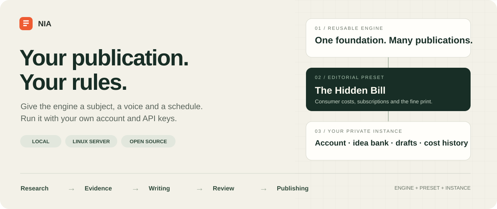
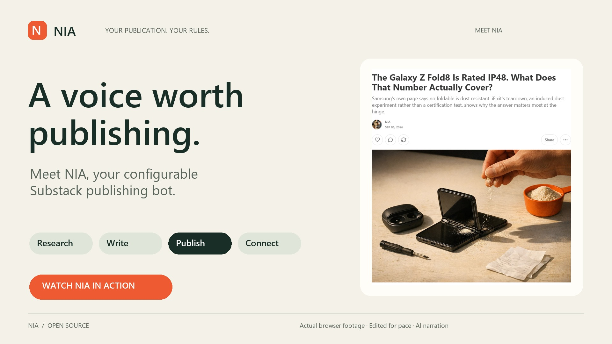

# NIA

[](https://github.com/krapcys1-maker/nia-substack-agent/actions/workflows/testy.yml)
[](docs/INSTALL.md)
[](LICENSE)

NIA is a configurable Substack publishing bot with portable editorial presets.
Choose a subject and writing style, add your own account and API keys, then run
the agent on your computer or a Linux server.

[](https://github.com/krapcys1-maker/nia-substack-agent/blob/main/docs/media/nia-demo.mp4)

**[Watch NIA in action](https://github.com/krapcys1-maker/nia-substack-agent/blob/main/docs/media/nia-demo.mp4)**
· [Demo and live examples](docs/DEMO.md) · [Download MP4](https://github.com/krapcys1-maker/nia-substack-agent/releases/download/demo-2026-09-06/nia-demo.mp4)

Real browser footage from the NIA test account, edited for pace. English AI
narration; articles, Notes and community actions use the Hidden Bill preset.

**The repository distributes the engine and reusable presets. Your account,
session, drafts, idea bank and spending history belong to your installation.**

[Installation](docs/INSTALL.md) · [Preset catalog](presety/README.md) ·
[Account and customization](docs/PLUGGING_IN_AN_ACCOUNT.md) ·
[Architecture and isolation](docs/PRESETY.md) ·
[Distribution audit — Polish](analizy/2026-09-06-dystrybucja-github/RAPORT.md)

## What the agent does

- Finds topic signals in configured RSS/Atom feeds, YouTube channels and searches.
- Scouts and evaluates ideas, builds an idea bank, retrieves sources and prepares evidence for writing.
- Writes articles, Notes, comments and replies using the preset's editorial direction and style assets.
- Applies evidence, structure and publication checks; records generated artifacts and model costs.
- Supports configurable publishing volumes, model roles, budget thresholds and schedules.
- Publishes through a browser session you establish yourself. Linux timers can run the workflows automatically.

This is a command-line project. Server browser setup and Windows scheduling
still require operator configuration. Its present writing method and checks are
primarily designed for evidence-based English nonfiction; a different language
or genre needs evaluation beyond changing the subject field.

## Choose a preset

| Preset | Editorial focus | Starting plan |
|---|---|---|
| [AI](presety/ai/preset.toml) | What AI systems actually demonstrate, cost and change | 2 Notes/day, 1 article/week |
| [The Hidden Bill](presety/hidden-bill/README.md) | Subscription terms, extra fees, repair restrictions and digital ownership | 2 Notes/day, 1 article/week |
| [Template](presety/SZABLON/preset.toml) | Build your own subject, sources and voice | Fill in the required fields before activation |

These are configured slots and limits, not guaranteed output or audience growth.
The Hidden Bill includes its own editorial prompts, style corpus, research and
launch ideas. Its launch document is an operator guide, not an automatic import
into the idea bank.

## Start with your own account

Use **Python 3.11 or newer**; Python 3.12 is the recommended starting point.
The preset loader uses `tomllib`, which is not available in Python 3.10.

```bash
git clone https://github.com/krapcys1-maker/nia-substack-agent.git
cd nia-substack-agent
python -m venv .venv
```

Activate the environment:

```bash
# Linux / macOS
source .venv/bin/activate
```

```powershell
# Windows PowerShell
.\.venv\Scripts\Activate.ps1
$env:PYTHONIOENCODING = "utf-8"
```

Install dependencies:

```bash
python -m pip install -r requirements.txt
python -m playwright install chromium
```

Copy the environment example (only in a fresh installation):

```bash
# Linux / macOS
cp .env.example agent-v2/.env
```

```powershell
# Windows PowerShell: also install the timezone data needed by presets
python -m pip install tzdata
Copy-Item .env.example agent-v2/.env
```

Fill in your `SUBSTACK_HANDLE`, `NAZWA_MARKI` and API keys in that local file.
Keep `DRY_RUN=true` during setup. The supplied presets use Anthropic and
DeepSeek for text; OpenAI is used for optional article images. Required keys
depend on the selected roles. The Hidden Bill starts with images disabled.

Then choose, inspect and activate a preset:

```bash
python narzedzia/presety.py lista
python narzedzia/presety.py sprawdz hidden-bill
python narzedzia/presety.py podglad hidden-bill
python narzedzia/presety.py podlacz hidden-bill --instancja moja-publikacja
python narzedzia/presety.py status
```

Use `ai` instead of `hidden-bill` to select the AI preset. **You do not edit the
shared preset to enter your account.** The values from `.env` override its
account placeholders. Changing the writing style or volumes uses a private copy
of the preset; see [customization](docs/PLUGGING_IN_AN_ACCOUNT.md).

**Next: [establish the browser session and run the first workflow](docs/INSTALL.md#5-browser-session).**
Activate the preset **before** saving the session so it is written into the
correct instance. Activation itself neither logs in nor publishes nor installs a scheduler.

## Engine, preset and instance

```text
GitHub: reusable engine + public preset packages
                         |
                    clone / download
                         v
Your installation: engine + selected preset + your .env
                         |
                  local activation pointer
                         v
Your instance: session, idea bank, drafts, cache, logs and costs
```

| Layer | Location | Tracked in Git? |
|---|---|---|
| Engine and generic prompts | `agent-v2/` | Yes |
| Public presets and their style assets | `presety/ai/`, `presety/hidden-bill/`, `presety/SZABLON/` | Yes |
| API keys and account settings | `agent-v2/.env` | No |
| Active preset pointer | `agent-v2/aktywny_preset.json` | No |
| Instance data, including the saved session | `agent-v2/instancje/<id>/` | No |
| Custom preset directories | Other directories under `presety/` | No |

Normal operation writes local runtime data, not the public preset files, and
does not push anything to GitHub. `.gitignore` excludes the private paths; the
repository audit also checks tracked files. These rules do not prevent someone
from deliberately force-adding a private file.

## Switch subjects or start clean

One checkout has one active preset at a time. Stop its scheduled tasks and
running processes before switching:

```bash
python narzedzia/presety.py odlacz
python narzedzia/presety.py podlacz ai --instancja ai-start
```

Use a **new instance ID** for a fresh bank and history. Reusing the previous ID
resumes its previous data; detaching does not erase data or remove `.env` and
browser credentials. It also does not undo anything already published on Substack.
Rebuild the schedule and verify the browser account after switching.

For separate publications, the clearest current arrangement is **one fresh clone
per publication**, with its own environment and runtime. Multiple clones on the
same machine additionally need browser and service isolation: Chrome's port and
profile and the generated systemd unit names are currently shared defaults.
See the [audit and remaining work](analizy/2026-09-06-dystrybucja-github/RAPORT.md).

## Costs and operating modes

Budget fields are per-instance thresholds based on the engine's cost records.
They are not a provider-enforced spending cap, a shared limit across clones or
a promise to complete the configured schedule. Actual charges depend on model
availability, provider prices, token usage, search and retries.

| Mode | Model calls | Substack writes |
|---|---|---|
| `presety.py sprawdz` / `podglad` | None | None |
| `DRY_RUN=true` | Skipped | Blocked |
| `DRY_RUN=false`, workflow without `--wyslij` | Can be paid | No publishing from that workflow |
| `DRY_RUN=false`, workflow with `--wyslij` | Can be paid | Enabled, subject to runtime checks |

A dry run can still read the network and create local files. Use preset preview
to inspect prompts without starting a publishing workflow. The engine supports
the provider adapters implemented in its code; adding a model name alone does
not add a new provider integration.

## Development and checks

```bash
python -m pip install -r requirements-dev.txt
python narzedzia/zaleznosci.py --sprawdz
python agent-v2/tests/test_presety.py
python narzedzia/presety.py sprawdz ai
python narzedzia/presety.py sprawdz hidden-bill
```

Tests are standalone scripts, not a conventional pytest-only suite. The
[workflow](.github/workflows/testy.yml) documents its exclusions and history-based
skips. These checks do not prove live account login, model access or publication
quality. Run maintenance generators and the full audit in a development checkout,
not while a production process is using its files.

Further reading: [function map](docs/FUNCTION_MAP.md),
[engine documentation](agent-v2/JAK_ZBUDOWANY_JEST_BOT.md),
[technical architecture](docs/ARCHITECTURE.md), [repository map](docs/REPO_MAP.md),
[troubleshooting](docs/TROUBLESHOOTING.md), [license](LICENSE).
