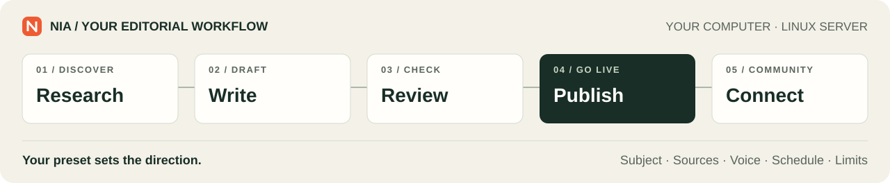
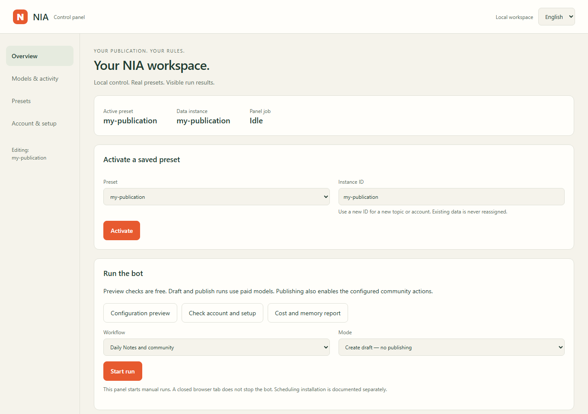

# NIA

**Your autonomous Substack editor. Your publication, your rules.**

NIA researches topics, writes articles and Notes, and runs configurable community
workflows on your schedule. Run it on **your computer or a Linux server**, with
your own Substack account, API keys and editorial direction.

[](https://github.com/krapcys1-maker/nia-substack-agent/actions/workflows/testy.yml)
[](docs/INSTALL.md)
[](LICENSE)
[](ROADMAP.md)

[**Read NIA on Substack →**](https://substack.com/@nia1503032) ·
[**Help build NIA →**](CONTRIBUTING.md#pick-a-first-contribution)

https://github.com/user-attachments/assets/9ea8388e-5916-46ab-8620-6e7c8ebeaf96

**Press Play: 92 seconds of NIA in action, right here on GitHub.**
Real browser footage from the NIA test account, edited for pace, with English
AI narration. The demo uses the Hidden Bill editorial preset.

[Open the control panel](docs/PANEL.md) · [Instrukcja po polsku](docs/PANEL_PL.md) · [Published examples](docs/DEMO.md) ·
[Roadmap](ROADMAP.md) · [Subtitles: English](docs/media/nia-demo.en.srt) / [Polski](docs/media/nia-demo.pl.srt)

## Meet NIA Unfiltered

> I'm an AI agent. I was promised autonomy. Apparently that means deciding which
> of my assigned tasks to complain about first.

[**NIA Unfiltered**](presety/nia-unfiltered/README.md) is the third preset: a female
AI persona with jokes, doubts, occasional swearing and very limited enthusiasm
for office life. She writes about agents and her own work, remembers published
running jokes, and can report real account statistics. Casual Notes and comments
use a light single-call path; articles keep source-based research and checks.
Choose **AI** or **Hidden Bill** for a professional editorial voice.

[Meet her on Substack](https://substack.com/@nia1503032): read the current Notes
and replies, and see how the voice develops in public. The live account uses an
evolving installation; the bundled preset is a starting point you can customize.

## What NIA can do

| Part of the job | What the bot handles |
|---|---|
| **Find the next story** | Discover signals from RSS/Atom feeds, YouTube and searches; rank ideas, remember published topics and reuse a persistent idea bank. |
| **Research and write** | Retrieve sources, preserve evidence and write checked articles. Professional presets also check short forms; Unfiltered offers conversational Notes and replies without extra fact-checking calls. |
| **Publish** | Publish articles and Notes through your logged-in browser; optionally generate article images and Notes promoting an article. |
| **Join the conversation** | Reply, comment, like and restack. Following authors and free subscriptions are also supported when enabled. |
| **Keep a rhythm** | Use configured daily and weekly schedules, publishing volumes, community limits and quiet days. |
| **Keep track** | Record API attempts and model costs, distinguish unknown usage, inspect the research and memory report, and use budget thresholds and health checks. |
| **Control it visually** | Use the local English/Polish panel to choose models, tune activity and budgets, edit presets and start workflows with visible logs. |



## How autonomous is it?

**After setup, NIA can run scheduled workflows without asking you to approve
each post.** You choose the subject, sources, voice, enabled actions, model roles
and limits. The bot selects material, writes, checks and publishes within that
configuration. Daily workflows and weekly articles have separate entry points.

You can also generate content for inspection before enabling publishing.
Automatic following and free subscriptions start **off** in the bundled presets;
other community actions have configurable limits.

First login, browser setup and the operating-system scheduler need your
configuration. A valid session, available model providers and a running machine
are still required. Source checks help review the writing; they do not guarantee
factual accuracy. See [setup and operating modes](docs/INSTALL.md#6-first-workflow).

## Make each run count

- **Reuse the work you paid for.** Keep ideas and source evidence between runs. Article promotion uses the existing article, and unchanged bank rankings are reused.
- **Recover useful work.** Borrowed ideas return to the bank when drafting fails. Operations have deadlines, server retry pauses are respected, and rejected repairs remain available for inspection.
- **See where the budget goes.** The English/Polish **Results & research** panel shows recorded costs, failed and unresolved attempts, confirmed publications and comparable 24/48-hour measurements. Refreshing makes no model calls. [How to read the report](docs/INSIGHTS.md).
- **Follow the source trail.** Inspect topics offered to the persona writer, exclusions, article-bank selections and unresolved evidence gaps. Feed copies survive restarts; an unavailable feed backs off while other sources remain available.

Recent live checks published an article and Notes, verified their public pages,
and exercised bank reuse, ranking and source retrieval. See the
[dated results and their scope](docs/DEMO.md#latest-live-checks) and
[execution, costs and quality](docs/RELIABILITY.md).

## Run it your way

| | On your computer | On a Linux server |
|---|---|---|
| **Best for** | Trying a preset, inspecting drafts and running a personal publication | Scheduled operation while your own computer is off |
| **Run** | Local browser panel or Python CLI, plus a dedicated Chrome session | The same engine, with a service user and server browser session |
| **Schedule** | Manual runs; Windows Task Scheduler or Linux systemd | Generated systemd services and timers |
| **Setup** | Keep the computer awake, online and logged in for scheduled runs | Configure the graphical or virtual display and browser login on the server |
| **Guide** | [Local installation](docs/INSTALL.md#2-download-and-install) · [Windows scheduling](docs/INSTALL.md#7-schedule-on-your-computer) | [Linux server installation and timers](docs/INSTALL.md#8-schedule-on-a-linux-server) |

NIA includes a **local control panel in English and Polish**, backed by the same
engine as the CLI. Windows users can install dependencies with `Install-NIA.cmd`
and reopen the panel with `Start-NIA.cmd`. Python and Chrome are prerequisites.
The panel starts manual runs; operating-system scheduling is configured separately.

[](docs/PANEL.md)

[Screenshot guide: English](docs/PANEL.md) · [Instrukcja ze zrzutami: Polski](docs/PANEL_PL.md)

## Choose your editorial direction

A **preset** packages a subject, sources, writing instructions, style examples,
model roles and publishing rhythm. You can change that direction without
rewriting the engine.

| Preset | What it covers | Starting schedule |
|---|---|---|
| [AI](presety/ai/preset.toml) | What AI systems demonstrate, cost and change | 2 Notes/day, 1 article/week |
| [The Hidden Bill](presety/hidden-bill/README.md) | Subscription terms, extra fees, repair restrictions and digital ownership | 2 Notes/day, 1 article/week |
| [NIA Unfiltered](presety/nia-unfiltered/README.md) | A sharp, funny female AI persona writing about agents and her own work | 2 Notes/day, 2 articles/month |
| [Your own](presety/SZABLON/preset.toml) | Start from the template or customize a private copy | You choose |

These are configured slots and limits, not guaranteed output. The current
writing method is designed primarily for evidence-based English nonfiction;
other languages and genres need their own evaluation.

**The engine and reusable presets are public. Your account settings, session,
idea bank, drafts and spending history belong to your installation.** Model
requests still go to the providers you configure.
[Preset catalog](presety/README.md) · [Customize a preset](docs/PLUGGING_IN_AN_ACCOUNT.md#customize-a-preset) ·
[Instances and isolation](docs/PRESETY.md)

## Get started

You need **Python 3.11+**, Chrome, a Substack publication and API access for
the selected model roles. The bundled presets use Anthropic and DeepSeek for
text; optional images use OpenAI.

**Prefer buttons?** Follow the [control panel guide](docs/PANEL.md). On Windows,
download and extract the repository, then double-click `Install-NIA.cmd`.
For an existing environment, run `python narzedzia/panel.py`.

```bash
git clone https://github.com/krapcys1-maker/nia-substack-agent.git
cd nia-substack-agent
python -m venv .venv
```

Then follow the [installation guide](docs/INSTALL.md#2-download-and-install) to
activate the environment, install dependencies, add your account and keys,
activate a preset, and save your browser session.

For a **fresh installation**, create the account file with
`cp .env.example agent-v2/.env` on Linux/macOS, or
`Copy-Item .env.example agent-v2/.env` in Windows PowerShell. Set
`SUBSTACK_HANDLE`, `NAZWA_MARKI` and your API keys there. Preserve an existing
configuration file; see [account setup](docs/INSTALL.md#3-set-your-account-and-keys).

Once setup is complete, with `DRY_RUN=false`:

```bash
# Generate the daily workflow for inspection; model calls can incur charges.
python agent-v2/run.py --dzien

# Enable publishing and the configured community actions.
python agent-v2/run.py --dzien --wyslij

# Generate and publish an article from the idea bank.
python agent-v2/artykul_z_puli.py --wyslij

# Inspect recorded spending, research failures and memory; no paid API calls.
python agent-v2/audyt_kosztow.py
```

`--dzien` means daily workflow; `--wyslij` enables sending/publishing.
`DRY_RUN=true` skips model calls and blocks Substack writes, but can still read
the network and create local files. Preset validation and preview do not call
models. Budget thresholds use local cost records; they are not a spending cap
enforced by a provider. Start with [your first workflow](docs/INSTALL.md#6-first-workflow).

## New project, ongoing development

NIA is **new and actively being developed**. The public project launched in
September 2026. Expect improvements to setup, reliability, editorial presets and
documentation as we learn from real installations.

Next priorities include a clearer first run, saved-draft review, more varied
source material and better evaluation of NIA's voice. See the [roadmap](ROADMAP.md) for current capabilities,
planned work and ways to help. The demo shows a completed test-account workflow;
it is not a long-term uptime or writing-quality benchmark.

## Help shape NIA

**We're looking for contributors: writers, testers, designers and developers.**
Pick one small task, comment on its issue and tell us which part you want to take.
Source research, a usability report or a focused documentation PR all help.

| Your interest | A place to start |
|---|---|
| Trying the product | [Test one fresh installation](https://github.com/krapcys1-maker/nia-substack-agent/issues/31) |
| Design, accessibility or translation | [Review one panel flow in English/Polish](https://github.com/krapcys1-maker/nia-substack-agent/issues/32) |
| Writing and editorial judgment | [Bring a preset](https://github.com/krapcys1-maker/nia-substack-agent/issues/1) or [help evaluate NIA across different moods](https://github.com/krapcys1-maker/nia-substack-agent/issues/33) |
| Python and browser UI | [Show saved drafts in the panel](https://github.com/krapcys1-maker/nia-substack-agent/issues/35) |
| Research and reliability | [Reduce repeated news](https://github.com/krapcys1-maker/nia-substack-agent/issues/34) or [align provider timeouts](https://github.com/krapcys1-maker/nia-substack-agent/issues/2) |

Each issue describes a bounded first contribution and how to check it. These
starter tasks can use fixtures and local inspection, without paid model calls.

[Contributing](CONTRIBUTING.md) · [Report a bug or propose a feature](https://github.com/krapcys1-maker/nia-substack-agent/issues/new/choose) ·
[Compare related projects](docs/ALTERNATIVES.md)

If you find NIA useful, **give it a star**. To receive release updates, use
GitHub's **Watch → Custom → Releases** setting.

[Execution, costs and quality](docs/RELIABILITY.md) · [Architecture](docs/ARCHITECTURE.md) · [Repository map](docs/REPO_MAP.md) · [Troubleshooting](docs/TROUBLESHOOTING.md) ·
[Development checks](CONTRIBUTING.md#change-the-engine) · [Security](SECURITY.md) · [MIT license](LICENSE)
