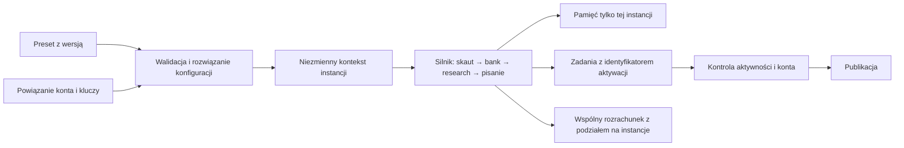

# Audyt czystości agenta i gotowości do wymiennych presetów

Data: 5 września 2026. Projekt: `D:\Nia bot`. Zakres: analiza kodu, konfiguratora, promptów, stylu, źródeł, pamięci, modeli, harmonogramu i mechanizmu publikacji. **To jest raport, bez wdrażania zmian.**

## Ocena

**Agent został w znacznej części oczyszczony z jawnych danych dawnego konta, ale nie jest neutralnym silnikiem, do którego można podłączyć pełny preset i później go wyjąć.** Obecnie jest jedną skonfigurowaną instalacją redakcyjną. Pakiety pomagają podmienić temat, natomiast pamięć, styl, część źródeł, parametry modeli i harmonogram mają odrębne mechanizmy. Nie ma operacji „odłącz preset i pozostań pusty”.

Najważniejszy brak to **granica między silnikiem, presetem, kontem i stanem konkretnej instancji**. Dopisanie większej liczby pól do TOML-a nie wystarczy. Trzeba również określić, kto jest właścicielem każdej kolejki, próbki stylu, zapamiętanego faktu, klucza i zadania czekającego na publikację.

| Pytanie | Wynik audytu |
|---|---|
| Czy w śledzonych plikach pozostały znane tożsamości starego konta? | W skanie 189 lokalnych wzorców znalazłem wyłącznie przykład opisujący dawny problem w samym narzędziu audytu. Nie znalazłem takiego trafienia w pozostałych śledzonych plikach. To wynik dla znanych wzorców, nie dowód braku każdego możliwego śladu. |
| Czy repozytorium ma neutralny temat i styl? | Nie. Bez konfiguracji włącza się konkretna nisza, angielski język i określona filozofia pisania. |
| Czy lokalna instalacja jest pusta? | Nie. Ma konfigurację, sesję, pamięć działań, indeks kandydatów i działający korpus stylu. |
| Czy istnieją presety obejmujące cały opisany przez użytkownika zakres? | Nie. Są cztery pakiety tematyczne, każdy po siedem pól. Żaden z obecnych czterech nie dostarcza kanałów YouTube ani list przykładów. |
| Czy przełączenie A → B jest izolowane? | Nie. Próby wykazały pozostawanie ustawień A, wyników z pamięci podręcznej i historii. |
| Czy można odłączyć preset i zatrzymać cały jego wpływ? | Brak takiego kontraktu i operacji. Usunięcie pliku konfiguracji przywraca wartości wbudowane. |
| Czy trzeba przepisywać całego bota? | Nie. Warto zachować potok researchu, ekstrakcję dowodów, zapis kosztów, adapter publikacji i część walidacji. Przebudowy wymaga sposób dostarczania im kontekstu i stanu. |

**Najprostszy sensowny wariant docelowy:** jeden silnik, jedna aktywna instancja naraz, pełny preset rozwiązywany przed startem, odrębny katalog jej danych i nowy proces po przełączeniu. Bez podmieniania globalnych ustawień wewnątrz pracującego procesu. Obsługę wielu równoczesnych instancji można dołożyć później.

## Co sprawdziłem i jak czytać dowody

Prześledziłem wykonanie od `packs` i kreatora przez loader konfiguracji, budowanie promptów, korpus źródeł, bank i cache, aż do harmonogramu oraz ponawiania publikacji. Wykonałem **24 numerowane próby diagnostyczne** opisane na końcu. Część to wywołania rzeczywistych funkcji na sztucznych danych, część to kontrolowany pomiar konfiguracji lub skan składni. Nie są to 24 testy pełnego działania na Substacku.

Próby korzystały z katalogów tymczasowych, atrapy wywołań modelu i bazy w pamięci. Lokalną bazę odczytałem przez SQLite w trybie `mode=ro`. Nie uruchamiałem płatnego researchu, generowania ani publikowania. Nie uruchamiałem całego `narzedzia/audyt.py`, ponieważ jego sekcja sprawdzania dokumentacji uruchamia generatory zapisujące pliki. Własny zapis w projekcie dotyczy wyłącznie niniejszego raportu.

Pomiary obejmują drzewo robocze, nie tylko ostatni commit. W trakcie audytu inne prace zmieniały m.in. `config.py` i `stages.py`; tych zmian nie wykonywałem ani nie cofałem. Punktem odniesienia przy pomiarze był HEAD `e5011211b0ddd5146f1f6e550bed17e4cf5921db` z dodatkowymi zmianami w drzewie. Odsyłacze wskazują funkcje w odczytanej wersji; dalsze edycje mogą przesunąć linie. Nie zweryfikowałem wdrożenia na serwerze ani całej historii obiektów Git.

„Czystość” oznacza tutaj brak niezamierzonego wpływu wcześniejszej konfiguracji na następny przebieg. Nie oznacza usuwania wiedzy wyuczonej przez model, kasowania opublikowanych tekstów z platformy ani zerowania poniesionych wydatków.

## 1. Pozostałości: co jest naprawdę czynne

### C1. Wbudowany temat uruchamia się po usunięciu konfiguracji — blokuje pusty rdzeń

W `config.py` nadal jest aktywna nisza „how everyday things are made and regulated”, 32 dziedziny ciekawostek, 24 hasła szukania i język English. Brak `konfiguracja.toml` daje pusty słownik nadpisań, więc pozostawia te wartości. Nie istnieje wymagany do pracy identyfikator aktywnego presetu.

**Skutek:** „wyjmuję preset” w dzisiejszej architekturze znaczy „wracam do wbudowanego profilu”. Zależnie od pozostałych kluczy, sesji i sposobu uruchomienia bot może nadal próbować działać; brak presetu sam w sobie go nie zatrzymuje. Nie twierdzę, że świeży klon bez kluczy i stylu od razu opublikuje artykuł.

**Zmiana:** przenieść obecne wartości do jawnego presetu przykładowego/zgodności. Pusty silnik może pokazać konfigurator i walidator, ale nie powinien rozpoczynać pobierania tematów, wywołań modeli ani publikacji.

Dowody: [domyślna nisza](</D:/Nia bot/agent-v2/config.py:2387>), [koniec ładowania konfiguracji](</D:/Nia bot/agent-v2/config.py:3364>), [brak pliku daje pusty słownik](</D:/Nia bot/agent-v2/konfiguracja.py:273>), T01.

### C2. Zmienny temat nadal trafia do redakcji o jednej filozofii

Podstawianie `{nisza}` i `{kat_redakcyjny}` jest realnym postępem. Nie wszystkie instrukcje stały się jednak neutralne. `SCOUT_SYSTEM` nadal objaśnia każdą niszę przez budowę rzeczy i to, kto decyduje, czym wolno im być. Domyślny blok `seam` szuka pisemnej reguły powstałej wskutek wcześniejszego niepowodzenia. Generatory oraz kalendarz miesiąca silnie eksponują decyzje, regulacje, instytucje, sprawozdania i sezon półkuli północnej.

To sensowna linia redakcyjna dla jednego profilu. Dla presetu „nauka i technika: objaśnianie odkryć” może wymuszać instytucjonalny konflikt tam, gdzie wartością jest eksperyment, wynik pomiaru lub nowy sposób działania urządzenia. Dobry temat może przegrywać dlatego, że nie pasuje do starego rodzaju opowieści.

**Zmiana:** rozdzielić uniwersalną rzetelność od wybieralnej metody redakcyjnej. Mechanizm, spór o regułę, wyjaśnienie odkrycia, poradnik i analiza danych powinny mieć własne wymagania. Nie każdy preset musi mieć wszystkie pięć list przykładów, obowiązkowy mit i kontrargument.

Dowody: [system skauta](</D:/Nia bot/agent-v2/stages.py:134>), [wspólne pola i instrukcje zastępcze](</D:/Nia bot/agent-v2/stages.py:238>), [generatory](</D:/Nia bot/agent-v2/config.py:3194>), [kalendarz](</D:/Nia bot/agent-v2/config.py:3300>), [brief pisarza](</D:/Nia bot/agent-v2/prompts/pisarz.md:159>).

### C3. Pisarz dostaje twierdzenie o historii publikacji, która może nie istnieć

Kotwica długości RICH mówi, że dwa najdłuższe zaakceptowane teksty tej publikacji przekraczają tysiąc słów i nie wydawały się długie. SINGLE również odwołuje się do wcześniejszych dłuższych tekstów. To czynna instrukcja, nie wyłącznie komentarz historyczny.

**Skutek:** zupełnie nowy preset dostaje wymyśloną historię własnych zatwierdzeń. Takich zdań nie należy traktować jako neutralnych zasad jakości ani przenosić między redakcjami.

**Zmiana:** deklaratywny zakres długości i uzasadnienie wynikające z rodzaju tekstu. Informacja o zaakceptowanych przykładach tylko wtedy, gdy pochodzi z rzeczywistego zbioru ocen tej instancji.

Dowód: [kotwice długości](</D:/Nia bot/agent-v2/config.py:750>).

### C4. Styl jest osobnym, wspólnym zestawem plików

Loader wybiera pierwszy alfabetycznie plik `.txt` w jednym katalogu stylu. Dwa profile mają stałe nazwy w katalogu `style-profiles`. Podmiana `{marka}` nie podmienia ich języka ani założeń. Profil pozytywny wprost wymaga naturalnego angielskiego i określonej sekwencji argumentacji.

Lokalny korpus istnieje mimo ignorowania przez Git. Pomiar `split()` dał **9391 słów**, a rzeczywisty loader poprawnie wczytał pięć przypiętych fragmentów o łącznej długości **2203 znaków**. To dowód działającego lokalnego głosu, nie stwierdzenie, że wszystkie jego treści dotyczą dawnego tematu. Nowy preset nie ma mechanizmu wyboru innego korpusu i przypięć.

Wywołania `load_examples()` i `load_profiles()` znalazłem w ścieżce pisania artykułu. Opis profilu negatywnego wymienia także Notes, ale sama deklaracja zakresu w pliku nie podłącza go do wszystkich notek i komentarzy. Obszerna instrukcja `CLAUDE_INSTRUKCJA_NATURALNEGO_PISANIA.md` nie jest automatycznie tym samym co materiał czytany przez ten loader.

**Zmiana:** preset powinien wskazywać konkretny profil stylu, język, próbki, przypięcia i zastosowanie do poszczególnych formatów. Dopuścić opis stylu bez korpusu, jeśli użytkownik właśnie tak chce zacząć; pokazać różnicę jakościową zamiast wymagać ręcznej instalacji dodatkowego pliku.

Dowody: [wybór korpusu](</D:/Nia bot/agent-v2/config.py:55>), [loader przykładów](</D:/Nia bot/agent-v2/style.py:116>), [loader profili](</D:/Nia bot/agent-v2/style.py:163>), [miejsce użycia przez pisarza](</D:/Nia bot/agent-v2/stages.py:714>), [profil pozytywny](</D:/Nia bot/style-profiles/ARTICLE_STYLE_PROFILE_V1.md>).

### C5. Czyste repozytorium i pusta instalacja to dwa różne wyniki

W 300 śledzonych plikach nie znalazłem nazw plików zabronionych przez listę audytu: lokalnej konfiguracji, bazy, sesji czy dziennika. Historia startowa ma `[]`. To dobre rezultaty wcześniejszego sprzątania.

Jednocześnie lokalny katalog danych zawierał 13 plików: bazę, blokadę procesu, budżety, czytelników, dziennik, indeks kandydatów, obserwowanych, płatne komentarze, statystyki, sesję, pamięć notek, wzrost i źródła. Baza podczas odczytu miała **9 przebiegów, 42 wywołania, 0 artykułów i 6 źródeł**. Nie wyciągam z tych liczb wniosku o kosztach czy stanie serwera — to lokalny pomiar w danym momencie.

**Zmiana:** audyt ma mieć oddzielny wynik „czystość dystrybucji” i „stan aktywnej instalacji”. Ignorowanie pliku w Git nie odłącza go od działającego bota.

Dowody: [.gitignore](</D:/Nia bot/.gitignore>), [historia startowa](</D:/Nia bot/agent-v2/prompts/historia_startowa.json>), [schema i dostęp do bazy](</D:/Nia bot/agent-v2/db.py:63>).

### C6. Narzędzie czystości ma lukę w analizie sklejonych stałych

`audyt.teksty()` łączy oryginał, wersję ze złożonymi liniami i wersję ze sklejkami. Późniejsza sekcja AST próbuje parsować ten połączony materiał jako program. Spośród **206 poprawnie parsowanych oryginalnych plików Pythona tylko 126** dawało się tak sparsować; 80 było pomijanych po `SyntaxError`. Wśród pominiętych były ważne moduły agenta.

To nie wyłącza całego skanera: zwykłe skany tekstu nadal działają. Oznacza jednak słabsze pokrycie konkretnej kontroli stałych, niż można oczekiwać z jej nazwy. Własny skan w tym audycie parsował oryginały oddzielnie od tekstów znormalizowanych.

Dodatkowo narzędzie sprawdza pliki śledzone, a nie komplet materiałów używanych lokalnie. Historyczny zakaz całych alfabetów, w tym greki, wymaga przemyślenia przy presetach naukowych: litery we wzorach nie świadczą o pozostałości poprzedniego konta.

**Zmiana:** AST wyłącznie z oryginału; tekstowe reprezentacje osobno; jawny licznik pominiętych plików; osobny skan gotowego kontekstu presetu. Pełny audyt powinien mieć faktyczny tryb tylko do odczytu, bez uruchamiania generatorów dokumentacji.

Dowody: [przygotowanie tekstów](</D:/Nia bot/narzedzia/audyt.py:176>), [analiza i generatory](</D:/Nia bot/narzedzia/audyt.py:208>), T19.

## 2. Jak dużo dzisiejsza konfiguracja rzeczywiście obejmuje

Loader ma **34 pola**, a mapa modeli **26 ról**. Nie jest to pusty punkt startowy, ale pola nie tworzą pełnego, wymiennego presetu.

| Element wymagany przez użytkownika | Obecnie | Czego brakuje |
|---|---|---|
| Temat, język, kąt redakcyjny | Są pola TOML | Pełnego zakresu: odbiorca, poziom wiedzy, wykluczenia i rodzaj materiału |
| Hasła szukania, dziedziny, znaczniki niszy | Są | Oddzielenia szukania rozmów na platformie od planu researchu artykułów |
| Kanały YouTube | Pole istnieje | Poprawnego przekazania słownika z pakietu przez kreator; odświeżania po zmianie |
| Własne RSS, strony startowe, bezpośrednie URL-e | Brak ogólnego rejestru w schemacie | Typu źródła, adresu, roli, częstotliwości, limitu, zasad pobierania i pochodzenia |
| Modele poszczególnych etapów | Mapa ról | Spójnego routera dostawców, parametrów, możliwości, cen i jawnego modelu zapasowego |
| Klucze API | Wspólny `.env` | Powiązania z właściwym kontem/dostawcą i jawnym profilem poświadczeń |
| Liczba notek | Długość miksu zwykłego dnia | Jednego kontraktu na wszystkie rodzaje dni; możliwości zera |
| Liczba artykułów | Harmonogram tygodniowy poza TOML | Częstotliwości, kwoty i reguł promocji wynikających z presetu |
| Polubienia, komentarze, restacki | Dzienne zakresy | Poprawnej walidacji i jasnego rozróżnienia celu, maksimum i niewypełnionej normy |
| Obserwacje i subskrypcje | Miesięczne zakresy | Spójności z pozostałymi limitami i kontem, również po zmianie tematu |
| Godziny pracy | Część pól i osobne timery | Harmonogramu generowanego z tego samego planu |
| Styl | Wspólne pliki i instrukcje | Pola stylu, stylu każdego formatu, własnych zasobów i pełnego podglądu promptów |
| Bank, pamięć, wyniki researchu | Wspólny katalog/baza | Właściciela danych i osobnych przestrzeni instancji |
| Podłączenie/odłączenie | Brak | Cyklu aktywacji, zatrzymania, archiwizacji, wznowienia i świeżego startu |

Źródła: [schema pól](</D:/Nia bot/agent-v2/konfiguracja.py:192>), [pakiety](</D:/Nia bot/narzedzia/pakiety.py:53>), [kreator](</D:/Nia bot/narzedzia/kreator.py:145>), [generator jednostek](</D:/Nia bot/narzedzia/jednostki.py:126>).

### K1. Pakiet tematyczny jest innym produktem niż pełny preset

`pakiety.py` celowo dopuszcza tylko `temat` i `zrodla`. Odrzuca konto, modele, wolumeny i pieniądze. Taka granica ma sens dla pakietu od obcego autora. Nie realizuje jednak osobistego presetu użytkownika, który ma zawierać całość ustawień redakcji.

Obecne cztery pakiety przechodzą reguły strukturalne, ale wszystkie mają tylko po siedem pól; brak kanałów i przykładów nie powoduje błędu. Nazwa opcji `--zastosuj` sugeruje aktywację, choć jej ścieżka wyświetla instrukcję dalszego użycia kreatora, nie montuje instancji.

**Zmiana:** zachować ograniczony pakiet tematyczny jako opcjonalny składnik. Nad nim dodać pełny osobisty preset, który jawnie rozwiązuje temat, styl, modele, źródła i plan pracy. Rozwiązany wynik zapisać w wersjonowanej postaci, bez dziedziczenia z poprzedniej instalacji.

### K2. Nakładanie ustawień zachowuje wartości poprzedniego presetu

`zastosuj()` podmienia wybrane stałe i wykonuje `.update()` na przykładach oraz mapie ról. W próbie A → B po zmianie niszy zostały kanały A, przykłady A, pisarz A i niestandardowe pytanie A o stan dziedziny. To poprawne zachowanie dla częściowej korekty tej samej konfiguracji, ale zła semantyka wymiany presetu.

Trzeba rozróżnić dwa przypadki. Przy nakładaniu zmian na żywy moduł zostają poprzednie wartości. Po restarcie i zastąpieniu całego pliku pominięte wartości mogą wrócić do domyślnych. Żaden wariant nie daje obietnicy „B działa tak samo bez względu na to, co było wcześniej”.

**Zmiana:** kompilować B od neutralnej bazy i zadeklarowanych zależności B. Dziedziczenie ma być jawne, wersjonowane i widoczne w podglądzie. Puste listy/słowniki powinny mieć zdefiniowane znaczenie „wyczyść”, a nie zależeć od prawdziwości warunku `if`.

Dowód: [nakładanie konfiguracji](</D:/Nia bot/agent-v2/konfiguracja.py:311>), T02.

### K3. Kreator może przenieść stare przykłady i zgubić nowe źródła

Domyślne odpowiedzi kreatora pochodzą z zaimportowanego `config`, czyli mogą już zawierać lokalną konfigurację A. Nie zawsze są wartościami świeżego silnika. Ponadto pakiet daje przykłady jako `temat.przyklady`, a kreator pyta o `temat.przyklady.kanon` i pozostałe podklucze. Słownik kanałów traktuje jak odpowiedź tekstową `nazwa=id`, przez co poprawny obiekt z pakietu nie przechodzi tą samą drogą co ręcznie wpisany tekst.

W próbie z przygotowanym wsadem B: przykład B nie trafił do wyniku, przykład A pozostał, kanały B nie zostały zapisane. Cztery obecne pakiety nie ujawniają tego problemu przy kanałach, bo ich nie dostarczają.

**Zmiana:** oddzielić parsowanie odpowiedzi człowieka od obsługi obiektów z pliku. Kreator powinien operować jednym modelem danych, a nie przekładać słownik na tekst i ponownie go zgadywać.

Dowód: [zbieranie odpowiedzi](</D:/Nia bot/narzedzia/kreator.py:145>), T09, T18.

### K4. Ponowny zapis nie zachowuje wszystkich ustawień

Kreator nie emituje ustawień `stan_dziedziny`, a serializer ma stałą listę sekcji, która tę sekcję pomija nawet wtedy, gdy dostanie ją jako dane. Pomijana jest również odpowiedź o dniu podniesienia budżetu. Role modeli i kanały mogą wypaść z nowego pliku, gdy użytkownik nie poda ich ponownie; komunikat o pozostawieniu bieżących wartości nie gwarantuje ich zachowania po restarcie.

**Skutek:** użytkownik poprawia np. liczbę komentarzy, a po zapisaniu całej konfiguracji przypadkiem zmienia również źródła, role albo codzienne sprawdzanie dziedziny. To zła podstawa importu/eksportu presetów.

**Zmiana:** round-trip całego modelu: odczyt → edycja jednego pola → zapis → ponowny odczyt ma zachowywać wszystkie pozostałe pola i ich znaczenie.

Dowód: [serializer](</D:/Nia bot/narzedzia/kreator.py:364>), T07, T09.

### K5. Walidacja nie określa poprawnego planu pracy

Walidatory przyjęły 1,5 przebiegu dziennie, ujemną liczbę komentarzy, ujemny miesięczny budżet, godziny 98–99 i datę `2026-99-99`. Sprawdzają część typów i kształtów, nie całą dziedzinę wartości. Niepusta lista napisów uniemożliwia prosty zapis pustego miksu notek.

**Zmiana:** liczności jako nieujemne liczby całkowite, poprawne strefy IANA, rzeczywiste daty i godziny, skończone nieujemne kwoty, jawne zero wyłączające daną aktywność. Do tego kontrola zależności: promocje potrzebują artykułów, dzienny plan musi zmieścić się w oknie, a wymagane narzędzie musi być dostępne dla wybranego modelu.

Dowody: [walidacja liczb i zakresów](</D:/Nia bot/agent-v2/konfiguracja.py:88>), T05.

### K6. Zapis i zastosowanie konfiguracji nie są atomowe

`zastosuj()` zmienia zwykłe pola przed sprawdzeniem specjalnych ról. Po błędzie nieznanej roli w próbie temat był już zmieniony. Przy zwykłym imporcie wyjątek przerywa start, więc nie należy z tego robić twierdzenia o automatycznej publikacji. Problem ujawni się jednak natychmiast przy próbie zbudowania przełączania w żywym procesie.

Kreator zapisuje docelowy TOML przed sprawdzeniem, czy da się go odczytać, a `.env` zapisuje później. Serializer nie koduje poprawnie nowej linii wewnątrz napisu. Przykładowa dwuwierszowa nisza wytworzyła niepoprawny TOML. `_slownik_list` dodatkowo odrzuca własny wynik przy ponownej walidacji: zwraca krotki, ale przyjmuje listy.

**Zmiana:** zbudować i w pełni zwalidować kandydata w pamięci lub katalogu roboczym; dopiero potem atomowo przełączyć wskaźnik aktywnej konfiguracji. Nie nadpisywać działającego profilu podczas zbierania niekompletnych danych. Poprawny parser/serializer i idempotentna normalizacja zamiast kolejnych wyjątków.

Dowody: [zastosowanie](</D:/Nia bot/agent-v2/konfiguracja.py:311>), [zapis w kreatorze](</D:/Nia bot/narzedzia/kreator.py:473>), [walidator przykładów](</D:/Nia bot/agent-v2/konfiguracja.py:164>), T03, T06, T08.

### K7. Brak wersji presetu i podglądu jego rzeczywistego działania

Schema nie ma wersji, zgodności z silnikiem, identyfikatora instancji ani odcisku rozwiązanej konfiguracji. Podgląd kreatora zamiast wartości przykładów, ról i miksu potrafi wyświetlić „handled separately”. Operator nie dostaje kompletnej odpowiedzi: „jakie instrukcje, źródła, modele i plan pracy faktycznie zostaną użyte?”.

**Zmiana:** podgląd pełnego presetu po rozwiązaniu zależności, pochodzenie każdej wartości oraz próbne złożenie wszystkich promptów. Dane uwierzytelniające pokazywać jako nazwę powiązania i stan dostępności. Eksport powinien dać się ponownie zaimportować do pustego silnika z tym samym wynikiem konfiguracyjnym.

## 3. Pamięć i odłączanie: główna granica architektoniczna

### S1. Nie ma właściciela stanu

Cztery główne tabele bazy nie mają kolumn wskazujących preset ani konto. Stan w plikach również odczytywany jest spod wspólnych ścieżek. Samo dodanie `preset_id` do nowych kandydatów nie załatwi pozostałych czytelników historii.

| Stan | Co przenosi | Docelowy właściciel |
|---|---|---|
| `indeks_kandydatow.json`, `bank_notek.json` | Pomysły, oceny, odrzucenia, wykorzystanie | Instancja presetu |
| `zuzyte_fakty.json`, `tematy_przegrane.json`, `wydarzenia_obsluzone.json` | Pamięć powtórek i nietrafionych tropów | Instancja presetu |
| `aktualne_modele.json` | Zapamiętany stan dziedziny | Instancja + temat + treść pytania + czas |
| `cache/*.json`, źródła i karty w bazie | Wyniki etapów researchu i pisania | Instancja + wejście + wersja etapu |
| `promocja.json`, `artykul_niewystawiony.json`, `karta_do_zatwierdzenia.json`, pliki artykułów | Materiał gotowy lub prawie gotowy do wysłania | Instancja + rewizja presetu + konto |
| Korpus, przypięcia i profile stylu | Wzorce wypowiedzi | Wersja presetu/stylu |
| Dziennik wysłanych działań, obserwowani, subskrypcje, sesja | Stan rzeczywistego konta na platformie | Konto, z oznaczeniem źródłowej instancji |
| Wydatki za wywołania | Już poniesione koszty | Wspólny rozrachunek płatnika + przypisanie do instancji |
| Statystyki i sygnały od czytelników | Informację, co działało | Surowe zdarzenia konta; wnioski rozdzielone według presetu |

**Zmiana:** odrębny katalog i baza redakcyjna instancji to dobry pierwszy krok. Rozrachunku całego konta i historii już wykonanych działań nie wolno przy tym zerować. Każdy zapis powinien znać instancję, rewizję i przebieg, który go utworzył.

Dowody: [schema bazy](</D:/Nia bot/agent-v2/db.py:63>), [bank notek](</D:/Nia bot/agent-v2/stages.py:6454>), [indeks](</D:/Nia bot/agent-v2/stages.py:6805>), [cache etapów](</D:/Nia bot/agent-v2/run.py:72>).

### S2. Data zmiany tematu nie zastępuje identyfikatora presetu

`DATA_PRZESTAWIENIA` jest przydatnym filtrem dawnej epoki. Porównuje jednak tylko dzień. Kandydat A z godziny 08:00 przechodzi filtr B aktywowanego tego samego dnia. Pusta data przepuszcza wszystko. Dwa presety mogą mieć tę samą datę; jeden preset można wznowić po innym.

Ponadto `recent_angles()` pobiera poprzednie tematy artykułów i promocje bez takiej granicy, a `tematy_do_porownania()` czyta wcześniejsze treści. Próba na bazie w pamięci i sztucznej promocji potwierdziła, że kontekst B otrzymuje historię A.

**Zmiana:** przypisanie danych do instancji jest podstawową regułą. Data służy świeżości. Dla odziedziczonych danych bez właściciela potrzebna jest jawna migracja albo odłożenie do archiwum; nie wolno zgadywać na podstawie samego dnia.

Dowody: [filtr banku](</D:/Nia bot/agent-v2/stages.py:7813>), [filtr reakcji](</D:/Nia bot/agent-v2/run.py:420>), [historia dla skauta](</D:/Nia bot/agent-v2/stages.py:295>), T20, T21.

### S3. Cache zwraca poprzedni temat jako nadal aktualny

Stan dziedziny ma kontrolę wieku, ale nie tożsamości tematu i pytania. Wyłączenie codziennego odpytywania nadal zwraca zapisane dane. W próbie B dostał `FACT_FROM_A` mimo wyłączenia pytania. Cache `run.cached()` ma plik nazwany etapem, bez odcisku wejścia; z `--use-cache` oddał stare tematy zamiast wytworzyć nowe.

**Zmiana:** klucze pamięci zależne od rodzaju danych. Wynik etapu powinien identyfikować co najmniej instancję, wejście, wersję promptu i model. Stan dziedziny dodatkowo pytanie i termin ważności. „Nie odświeżaj” powinno oznaczać używanie własnych ważnych danych, a nie dowolnego starego pliku.

Dowody: [stan dziedziny](</D:/Nia bot/agent-v2/aktualne_modele.py:118>), [cache etapów](</D:/Nia bot/agent-v2/run.py:72>), T11, T13.

### S4. Przekierowanie katalogu nie czyści pamięci procesu

`uzyj_katalogu_danych()` poprawnie przenosi wiele ścieżek i jest użytecznym mechanizmem izolacji testów. Nie jest przełącznikiem całego presetu. Nie przestawia profilu Chrome, pliku `.env` ani stylu, a pamięć `_ZAPAS` kanałów nadal zawiera wpisy A.

Do tego `SCOUT_SYSTEM` i inne napisy są składane podczas importu. `_pola_wspolne()` czyta część wartości na bieżąco. Próba dała jednocześnie system A i pola użytkownika B. Kopia `KANALY` oraz `PROFIL_HANDLE` również pozostały stare.

**Zmiana:** na pierwszą wersję przełączenia kończyć proces A i uruchamiać nowy proces z kompletnym kontekstem B. Docelowo przekazywać niezmienny kontekst do funkcji, zamiast szukać wszystkich globalnych zmiennych do wyzerowania. Nie przedstawiać testowego przekierowania ścieżek jako gotowej obsługi presetów.

Dowody: [przekierowanie danych](</D:/Nia bot/agent-v2/config.py:2963>), [kopiowane kanały](</D:/Nia bot/agent-v2/korpus_kanalow.py:54>), [cache kanałów](</D:/Nia bot/agent-v2/korpus_kanalow.py:330>), T10, T12.

### S5. Oczekujący artykuł i promocje nie mają granicy aktywacji

Odczyt niewystawionego artykułu sprawdza, czy jest słownik ze ścieżką. Nie sprawdza właściciela, rewizji ani tego, czy źródłowy preset jest nadal aktywny. Sztuczny artykuł A został odczytany przy B. To samo zagadnienie dotyczy promocji, kart do zatwierdzenia i ewentualnych wyników pracy kończącej się po przełączeniu.

Nie publikowałem takiego tekstu na platformie, więc wynik jest dowodem dopuszczenia starego zadania przez loader, nie pomiarem błędnej publikacji.

**Zmiana:** każdy zamiar wysłania ma znać konto, instancję, rewizję i numer aktywacji. Tuż przed wysłaniem trzeba sprawdzić, czy uprawnienie do pracy tej aktywacji nadal obowiązuje. Odłączenie ma zatrzymać pobieranie nowych zadań i unieważnić możliwość wysłania pozostałych; wznowienie wymaga ich ponownej kwalifikacji.

Dowód: [odczyt oczekującego artykułu](</D:/Nia bot/agent-v2/stages.py:3114>), T22.

### S6. Sesja i klucze pozostają poza cyklem życia presetu

Kreator zachowuje poprzednie klucze przy pustej odpowiedzi, a także istniejące `DRY_RUN=false`. Próba używała wyłącznie fikcyjnego klucza i tymczasowego `.env`. Nowy temat nie oznacza więc nowego powiązania z dostawcą ani powrotu do stanu nieaktywnego.

Profil Chrome ma wspólną ścieżkę w katalogu użytkownika, poza katalogiem danych. Istnieje kontrola konta przed wieloma działaniami — to warto zachować — ale zapamiętuje wynik raz na proces i przy braku odpowiedzi pozwala iść dalej. Odpytuje profil wskazanego uchwytu; samo uzyskanie publicznego profilu tego uchwytu nie jest wystarczającym dowodem, kto jest zalogowany. Nie sprawdzałem odpowiedzi rzeczywistego API Substacka w tym audycie. Próby potwierdziły przejście przy braku odpowiedzi i pominięcie kolejnego sprawdzenia po zmianie uchwytu w procesie.

**Zmiana:** konto i poświadczenia mają własny identyfikator powiązania. Preset może wskazać to powiązanie, ale nie powinien po cichu korzystać z odziedziczonego. Przy aktywacji sprawdzić uwierzytelnioną tożsamość i docelową publikację, a nie tylko istnienie profilu. Klucze i sesji nie umieszczać w przenośnym eksporcie presetu.

Dowody: [zapis kluczy](</D:/Nia bot/narzedzia/kreator.py:407>), [profil Chrome](</D:/Nia bot/agent-v2/browser.py:429>), [kontrola konta](</D:/Nia bot/agent-v2/browser.py:69>), T17, T23.

## 4. Modele, jakość i wolumeny

### M1. Nazwa modelu w konfiguracji nie tworzy adaptera dostawcy

Tekstowa funkcja `llm.call()` obsługuje obecnie Anthropic i DeepSeek. Rozpoznaje prefiks OpenAI, ale jawnie odrzuca tego dostawcę w ścieżce tekstowej. W próbie przypisanie `gpt-6-astra` do `write` zakończyło się `PreflightFailed` z informacją o braku ścieżki OpenAI. Nie wykonano zapytania do API.

Oficjalna dokumentacja pokazuje `gpt-6-astra` w Responses API. Zatem problem opisany tutaj dotyczy **integracji tego projektu**, a nie samego istnienia identyfikatora. Nie sprawdzałem uprawnień konkretnych kluczy ani nie mierzyłem jakości modelu na tych tekstach. [OpenAI — Responses API](https://developers.openai.com/api/reference/typescript/resources/beta/subresources/responses/methods/create).

**Zmiana:** rejestr dostawców i modeli z jawnymi możliwościami: tekst, poprawny format strukturalny, wyszukiwanie, pobieranie listy źródeł, obrazy, limity wejścia/wyjścia i obsługiwane parametry. Aktywacja presetu sprawdza wymagania wszystkich włączonych ról. Samo pole `write="nazwa"` jest niewystarczające.

Dowód lokalny: [router tekstowy](</D:/Nia bot/agent-v2/llm.py:546>), T24.

### M2. Rola obrazu i rzeczywisty model obrazu mogą się rozjechać

Zmiana `modele.role.obraz` zmienia mapę używaną m.in. przez kontrolę wstępną, lecz payload obrazu czyta `config.IMAGE_MODEL`. W próbie jedna wartość została zmieniona, druga pozostała bez zmian. Koszt i raportowanie też korzystają z oddzielnych stałych obrazu.

**Skutek:** użytkownik może sądzić, że wybrał inny model, choć właściwe żądanie użyje dotychczasowego. To szczególnie ważne dla presetu z własną polityką kosztu i jakości okładek.

**Zmiana:** jeden rozwiązany opis wywołania — model, dostawca, parametry, uprawnienie i wycena — używany przez walidację, żądanie oraz zapis kosztu. Obraz wyłączany jawnym polem, jeśli preset go nie potrzebuje.

Dowód: [generowanie obrazu](</D:/Nia bot/agent-v2/llm.py:676>), T15.

### M3. Preset nie opisuje całej polityki jakości i wydatków

Mapa ról nie obejmuje całej decyzji wykonawczej. Wysiłek rozumowania, limity tokenów, wyszukiwań, wariantów i napraw oraz ścieżki awaryjne są w innych miejscach. Przykładowo fallback pisarza w `run.py` sięga po wbudowaną stałą modelu. Zmiana podstawowego pisarza nie musi zatem określać, co stanie się po jego awarii.

**Zmiana:** dla roli ustalić model główny, dopuszczony model zapasowy albo zatrzymanie, możliwości, parametry, maksymalny koszt pracy i warunek eskalacji. Nie trzeba pokazywać użytkownikowi 26 zaawansowanych formularzy: interfejs może oferować kilka grup, lecz wynik musi rozwiązać wszystkie używane role i ujawnić wyjątki.

Oszczędności nie należy deklarować wyłącznie po cenie tokena. Wariant wymagający trzech napraw może być droższy od mocniejszego pisarza. Mierzyć koszt zaakceptowanej notki/artykułu, łącznie z odrzutami i ponowieniami, osobno dla tematu oraz stylu. Wynik poprzedniej redakcji nie jest automatyczną odpowiedzią dla nowego presetu.

Dowody: [role modeli](</D:/Nia bot/agent-v2/config.py:169>), [parametry i limity](</D:/Nia bot/agent-v2/config.py:924>), [fallback pisarza](</D:/Nia bot/agent-v2/run.py:2618>).

### M4. Dowolna nazwa języka nie oznacza gotowej jakości w tym języku

Obecne `jezyki.py` zawiera English i Polish. Polski ma wszystkie kategorie wzorców i fraz obecne w angielskim — to działający element, którego nie należy opisywać jako brakującego. Sprawdzenie obecności kategorii nie jest jednak pomiarem skuteczności bramek.

Kreator sugeruje także German, a próba wykazała brak dziewięciu kategorii kontrolnych dla tego języka. Przy nieznanym języku moduł ostrzega i wyłącza daną heurystykę. Wspólny profil stylu nadal nakazuje English, co dodatkowo wymaga rozstrzygnięcia przy polskim presecie.

**Zmiana:** deklarować poziom obsługi języka: pisanie, walidacja, podział słów, źródła i próbki. Przy aktywacji podać konkretnie, które kontrole będą dostępne. Dla każdego wspieranego języka przygotować przykłady dobrych i błędnych tekstów zamiast utożsamiać obecność słownika z jakością.

Dowody: [obsługa brakujących wzorców](</D:/Nia bot/agent-v2/jezyki.py:248>), [profil artykułu](</D:/Nia bot/style-profiles/ARTICLE_STYLE_PROFILE_V1.md>), T14.

### W1. Liczba notek nie ma jednego znaczenia

Pole `publikowanie.miks_notek` aktualizuje tylko `NOTE_MIX_OTHER_DAY`. `NOTE_MIX_ARTICLE_DAY` pozostaje oddzielne i jest używane przez planowanie. W próbie po wyborze jednego elementu zwykły dzień miał jedną notkę, a dzień artykułu pięć. Nie jest to wyłącznie martwa stała.

**Zmiana:** użytkownik podaje dzienny cel i/lub maksimum, a proporcje typów decydują, jak wypełnić te same sloty. Promocja artykułu powinna domyślnie zajmować slot w tej kwocie. Jeśli ma zwiększać liczbę notek, preset musi powiedzieć to jawnie. Zero powinno wyłączać format bez potrzeby obchodzenia walidatora.

Dowody: [zastosowanie miksu](</D:/Nia bot/agent-v2/konfiguracja.py:311>), [miks dnia artykułu](</D:/Nia bot/agent-v2/config.py:1820>), [użycie miksu przez etapy](</D:/Nia bot/agent-v2/stages.py:1012>), T04.

### W2. Liczba artykułów i rzeczywisty zegar są poza presetem

Szablon artykułu wskazuje wtorkowe uruchomienie. Szablon głównego agenta ma pięć stałych godzin. Generator jednostek podmienia katalog, użytkownika i opis marki, a nie oblicza tych godzin z zadeklarowanego wolumenu. Samo ustawienie innej liczby przebiegów nie przepisuje działającego timera.

**Zmiana:** jeden plan pracy uwzględniający strefę, dni, limit artykułów i notek oraz czas researchu przed terminem publikacji. Scheduler powinien odczytywać ten plan, a jeśli pozostaje systemd — generować zegary z tego samego źródła. Potrzebne są reguły nadrabiania po awarii, cichych dni i zmiany czasu. „Dwa artykuły tygodniowo” ma obejmować dwie okazje publikacji, nie tylko dwie próby napisania.

Dowody: [timer artykułu](</D:/Nia bot/agent-v2/systemd/nia-artykul.timer:15>), [timer agenta](</D:/Nia bot/agent-v2/systemd/nia-agent.timer:48>), [generator](</D:/Nia bot/narzedzia/jednostki.py:126>).

### W3. Norma działań musi odróżniać zamiar od wyniku

Zakresy komentarzy, polubień i innych działań już istnieją. Dla pełnego presetu trzeba określić, czy użytkownik podaje cel, twarde maksimum, liczbę prób czy liczbę działań potwierdzonych na platformie. Po zmianie presetu w połowie doby nie można ponownie dostać całego dziennego limitu tego samego konta.

**Zmiana:** plan pokazuje „cel 8, maksimum 10”, licznik wykonania opiera się na potwierdzonych działaniach, a niewykonanie ma powód: brak odpowiednich postów, budżet, limit czasu, awaria lub blokada jakości. Bot nie powinien dopisywać słabych komentarzy wyłącznie dla domknięcia licznika. Priorytet przy zbyt małym budżecie też musi być częścią planu, np. własna notka przed rozszerzaniem aktywności społecznej.

Dowody: [pola wolumenów](</D:/Nia bot/agent-v2/konfiguracja.py:192>), [budżet działań i przebieg dzienny](</D:/Nia bot/agent-v2/run.py:1010>).

### W4. „Skąd brać tematy” i „czym dowodzić” są niedostatecznie rozdzielone

Hasła szukania kont do rozmowy, kanały sygnałowe, źródła researchu i materiały do ostatecznych twierdzeń pełnią inne funkcje. Dzisiejszy preset nie umie opisać ich jako rejestru adresów z rolami. Sama lista dziedzin nie jest listą konkretnych miejsc pobierania materiału.

W kodzie jest również adapter Federal Register. Jest zależny od jednego kraju i angielskich wzorców sporu, lecz nie znalazłem jego wywołania w produkcyjnym potoku. Nie należy więc liczyć go jako obecnego automatycznego zanieczyszczania wszystkich tematów ani jako gotowego źródła podłączanego presetem. Może być jednym z adapterów dostępnych na życzenie.

**Zmiana:** źródło ma typ (`rss`, strona, lista URL, kanał, API, wyszukiwarka), adres, rolę, zakres tematyczny, język, częstotliwość, sposób odczytu i limit. Role co najmniej: sygnał do skauta, dowód pierwotny, materiał pomocniczy, miejsce rozmowy. Sygnał z YouTube może prowadzić do dokumentacji eksperymentu; nie staje się z tego powodu automatycznie potwierdzonym dowodem.

Dla adaptera OpenAI lista preferowanych/dozwolonych domen może być przekazana do narzędzia wyszukiwania w Responses API. To część integracji źródeł, a nie zamiennik późniejszego pobrania i oceny dokumentu. [OpenAI — Web search](https://developers.openai.com/api/docs/guides/tools-web-search).

Dowody lokalne: [schema źródeł](</D:/Nia bot/agent-v2/konfiguracja.py:192>), [korpus kanałów](</D:/Nia bot/agent-v2/korpus_kanalow.py:334>), [adapter Federal Register](</D:/Nia bot/agent-v2/stages.py:7976>).

## 5. Docelowa konstrukcja

### Cztery obiekty, których nie należy mieszać

| Obiekt | Zawiera | Nie dziedziczy automatycznie |
|---|---|---|
| **Silnik** | Etapy, adaptery, kontrakty danych, podstawowe reguły rzetelności, wykonanie i pomiar | Tematu, marki, osobowości, źródeł ani pamięci konkretnej publikacji |
| **Preset w wersji X** | Temat, odbiorcę, styl, źródła, reguły redakcyjne, modele, plan ilościowy i finansowy | Ustawień ostatnio używanego presetu |
| **Powiązanie konta** | Tożsamość publikacji, sesję, wskazania kluczy, fakty już wykonanych działań i wspólny rozrachunek | Stylu i banku poprzedniego tematu |
| **Instancja presetu** | Konkretną aktywację na konkretnym koncie, bank, research, szkice, oceny, wersję kontekstu | Pamięci innej instancji bez jawnej operacji importu |

To mogą być zwykłe obiekty Pythona, pliki i SQLite. Na start nie potrzeba mikroserwisów, orkiestratora wielu agentów ani osobnej bazy wektorowej tylko dlatego, że pojawia się słowo „preset”.

Schemat proponowany, jeszcze nieistniejący w projekcie:

Najważniejsza własność: **skompilowanie B w pustym silniku daje ten sam kontekst konfiguracyjny co skompilowanie B po używaniu A**. Nie wymagam identycznego tekstu modelu ani identycznych wyników internetu; wymagane są te same ustawienia i granice dostępu do danych.

### Co dokładnie powinien zawierać preset

Poniższa tabela jest propozycją schematu, nie opisem działających dziś kluczy TOML.

| Sekcja | Minimalny kontrakt |
|---|---|
| Tożsamość presetu | `schema_version`, `preset_id`, rewizja, nazwa, wersja zgodnego silnika; pełne rozwiązanie importowanych pakietów |
| Temat i odbiorca | Zakres i wykluczenia, podtematy, poziom wiedzy, cel publikacji, język, obszar geograficzny |
| Linia redakcyjna | Rodzaje tematów, czego szukamy w materiale, dopuszczona opinia, sezonowość lub jej brak |
| Źródła | Rejestr adapterów/adresów, rola, priorytet, częstotliwość, język, dozwolone domeny, zasady przejścia od sygnału do dowodu |
| Skaut | Pokrycie podtematów, proporcja aktualności i materiałów trwałych, szerokość poszukiwania, koszt/czas jednej rundy |
| Bank | Wymagane pola pomysłu, ważność, stan weryfikacji, zapas minimalny i maksymalny wynikający z popytu |
| Research | Wymagania dowodowe danego formatu, świeżość, różnorodność źródeł, warunki zakończenia lub odrzucenia |
| Styl | Opis głosu, poziom specjalistyczności, słownictwo, humor, osoba gramatyczna, dopuszczone formy; osobne ustawienia artykułu/notki/komentarza |
| Zasoby stylu | Jawne pliki, ich skróty, język, przypięcia i przeznaczenie; możliwość pracy wyłącznie z opisem |
| Modele | Dostawca i model dla każdej aktywnej roli, parametry, narzędzia, limity, fallback, wycena z datą |
| Wolumeny | Cele i maksima dla notek, artykułów, komentarzy, polubień, odpowiedzi, restacków, obserwacji, subskrypcji |
| Harmonogram | Strefa, okna, dni, częstotliwość, ciche dni, nadrabianie i reguła promocji w ramach liczby notek |
| Budżet | Kwoty na okres i zadanie, maksymalny koszt pojedynczej naprawy, priorytety redukcji przy braku pieniędzy |
| Powiązania | Referencja do konta i profilu poświadczeń; rzeczywiste sekrety pozostają w lokalnym magazynie |

**Nie wkładać do eksportowanego presetu** bieżących cookies, kluczy API, historii komentowania, opublikowanych działań ani zadań oczekujących. Wznowienie całej instancji to inny rodzaj kopii niż eksport ustawień. Użytkownik może nadal w jednej operacji „podłączyć preset i podać klucze”; wewnętrznie powstają dwa różne obiekty.

### Jak mogłoby wyglądać ustawienie „technika i nauka”

To przykład produktu, nie gotowy plik do uruchomienia:

> Piszesz po polsku dla ciekawych osób bez przygotowania akademickiego. Temat: technika i odkrycia naukowe, ze szczególnym uwzględnieniem materiałów, energii i metod pomiaru. Tłumacz, co pokazano i jak to działa. Wyraźnie odróżniaj wynik eksperymentu od zapowiedzi firmy. Styl: konkretny, spokojny, z obrazowym wyjaśnieniem pojęcia; bez wymuszania sporu z regulatorem. Dwie notki dziennie i jeden artykuł tygodniowo. Promocja artykułu mieści się w dwóch notkach. Komentarze: cel pięć, maksimum osiem, wyłącznie gdy można coś dodać. Polubienia: maksimum dziesięć. Obserwacje i restacki wyłączone. Źródła: moje wybrane feedy, kanały i strony dokumentacji, rozdzielone na sygnały i dowody. Mocny model pisze artykuł; tańszy klasyfikuje; osobna rola sprawdza dowody. Klucze podaję w kroku podłączenia. Budżet miesięczny i dzienny wybieram jawnie.

Z tego opisu konfigurator powinien utworzyć plan do przejrzenia, a nie od razu improwizować działanie. Trzeba doprecyzować rzeczy wymagane do wykonania: prawdziwe adresy, identyfikatory modeli, dzień/godzinę artykułu, budżety oraz konto. Ogólny opis źródeł „dobre portale naukowe” nie jest równoważny zatwierdzonej liście URL-i.

### Jak podzielić prompt, żeby styl faktycznie się zmieniał

Proponowana konstrukcja każdego wywołania:

1. **Zasady stałe silnika:** rozróżnianie instrukcji od pobranych danych, brak zmyślonych dowodów, wymagany format odpowiedzi.
2. **Krótka instrukcja roli:** co ma zrobić skaut, klasyfikator, pisarz albo kontroler i po czym rozpoznać zakończenie.
3. **Profil redakcyjny presetu:** odbiorca, zakres, język i kryteria doboru tematu potrzebne tej roli.
4. **Styl danego formatu:** tylko dla ról, które piszą lub oceniają formę. Z przypiętymi przykładami, jeśli istnieją.
5. **Dane konkretnego zadania:** dokumenty, karta dowodowa, wybrany temat, granice długości i dostępny budżet.

Nie wysyłać pełnego manifestu każdemu modelowi. Klasyfikator źródła nie potrzebuje miesięcznej normy polubień ani pięciu fragmentów stylu pisarza. Komentarz nie potrzebuje pełnego protokołu budowania długiego artykułu. Ogranicza to koszt i liczbę sprzecznych instrukcji.

Zmiana stylu powinna również zmieniać ocenę formy. Jeśli preset dopuszcza formę pytań i odpowiedzi, recenzent nie może jej odrzucać dlatego, że poprzedni profil nie lubił nagłówków. Reguła prawdziwości pozostaje wspólna; preferencja formy należy do presetu.

Osobny podgląd powinien pokazywać gotowy system i wiadomość zadania dla skauta, notki, artykułu, komentarza oraz recenzji. Tak najłatwiej znaleźć sytuację, w której nowa nisza ma wciąż stary brief pod spodem.

## 6. Co ma się wydarzyć przy podłączaniu i odłączaniu

### Podłączenie

1. Odczytaj preset, sprawdź wersję i rozwiąż wszystkie jawne zależności od neutralnej bazy.
2. Zweryfikuj pola, zasoby stylu, źródła, role i parametry. Złóż prompty i plan tygodnia bez płatnych wywołań.
3. Pokaż pełne ustawienia oraz braki. Oddziel błąd uniemożliwiający pracę od świadomie wyłączonej funkcji.
4. Powiąż konto i wybrane profile kluczy. Sprawdzenie dostępu do API, jeżeli potrzebne, ma być oddzielnym, opisanym krokiem; walidacja pliku nie powinna sama generować płatnej treści.
5. Utwórz nową instancję albo wskaż istniejącą do wznowienia. Żadnej niejawnej adopcji wspólnego `data/`.
6. Zapisz rozwiązany kontekst i jego odcisk; aktywuj jednym przełączeniem. Uruchom świeży proces z tym kontekstem.

Weryfikację korpusu, formatu i zgodności modelu należy przeprowadzać przed researchem. Odkrycie wadliwego pliku stylu dopiero po zapłaceniu za zebranie źródeł jest kosztem możliwym do uniknięcia.

### Odłączenie

Najpierw zmienić stan aktywacji tak, aby żadne nowe zadanie nie mogło otrzymać zgody na wykonanie. Następnie zatrzymać planowanie i pracujący proces. Wynik kończącego się researchu może zostać zapisany do archiwum jego instancji, ale nie może trafić do następnego presetu.

Operację wysłania, która już została przyjęta przez platformę, trzeba rozliczyć jako wykonaną. Nie da się uczciwie obiecać cofnięcia jej przez późniejsze „odłącz”. Dla zadania o niepewnym wyniku należy najpierw sprawdzić stan na platformie, zanim ponowienie stworzy duplikat.

Po odłączeniu:

- brak aktywnego presetu oznacza brak nowego skautingu, wywołań modeli i działań publikacyjnych;
- jego bank, szkice, cache i styl nie są dostępne następnemu kontekstowi;
- archiwum pozostaje możliwe do wznowienia lub usunięcia w osobnej operacji;
- historia faktycznie opublikowanych działań i wydatków nadal należy do konta/płatnika;
- przeglądarka i połączenia poprzedniej instancji są zamknięte, a pamięć jej procesu znika.

Do pierwszej wersji wystarczy zatrzymanie i nowy proces. Mechanizm wymiany kontekstu w pracującym procesie byłby trudniejszy do zweryfikowania i wymagałby obsługi wielu istniejących kopii ustawień.

### Ponowne podłączenie A po używaniu B

Użytkownik powinien mieć trzy odrębne działania:

| Działanie | Efekt |
|---|---|
| Wznów A | Wróć do jego banku, szkiców i ocen; ponownie sprawdź świeżość i zgodność wersji |
| Nowa instancja z presetu A | Ten sam temat i styl, pusty stan redakcyjny, historia konta i rachunek zachowane |
| Importuj wybrane materiały | Jawnie przenieś wskazane dokumenty/pomysły; zapisz pochodzenie i ponownie oceń ich przydatność |

Samo podpięcie stylu A nie oznacza zgody na import tekstów, które A kiedyś przeczytał. Podobnie nowa instancja nie powinna ponownie komentować tego samego posta tylko dlatego, że wyzerowano jej bank pomysłów. Publiczna historia konta może być używana do unikania powtórek działań bez wkładania dawnych tematów do briefu nowej redakcji.

## 7. Jak utrzymać niski koszt bez pogarszania treści

**Pierwsza oszczędność: nie zbierać materiału dla nieaktywnego lub błędnego presetu.** Pełna kontrola konfiguracji przed pracą usuwa puste wyszukiwania, zły język, zgubione kanały i research kończący się błędem stylu. To bezpośredni skutek poprawy architektury, a nie obniżenia jakości modelu.

**Druga: bank zasilać według realnego popytu.** Docelowy zapas powinien wynikać z liczby planowanych tekstów, długości ważności tematów i faktycznej skuteczności zamiany pomysłu w publikację. Przy dwóch notkach dziennie nie potrzeba tego samego uzupełniania co przy dziesięciu. Przykładowe planowanie: zapas = popyt na kilka dni / zmierzony udział kandydatów kończących się akceptacją. To reguła planistyczna do kalibracji, nie nowa stała wpisana na zawsze.

**Trzecia: rozdzielić rodzaje pamięci podręcznej.** Publiczny pobrany dokument można przechowywać raz, pod kanonicznym URL-em i skrótem treści, z datą pobrania. Ocena jego przydatności, wybór cytatów i karta tematu należą do kontekstu instancji. Oszczędzanie pobrań nie może polegać na zwracaniu B ocen wykonanych dla A. Materiały prywatne i wymagające sesji pozostają w granicach właściwego konta.

**Czwarta: tani odsiew, droższe decyzje tam, gdzie poprawiają wynik.** Pobranie RSS, deduplikacja adresów, walidacja schematu i limitów nie wymagają modelu. Klasyfikacja i wstępny ranking mogą używać tańszego modelu. Droższy pisarz otrzymuje już wybrany materiał z dowodami, a eskalacja następuje po określonym problemie, nie przy każdym zadaniu. Tańszy wariant trzeba porównać na materiałach danego presetu, uwzględniając naprawy.

**Piąta: stabilne, krótkie instrukcje właściwej roli.** Stałe elementy warto umieszczać przed zmiennymi danymi. Dla OpenAI trafienie w cache wymaga zgodnego prefiksu; obecna dokumentacja opisuje także znaczenie punktu cache po części stałej i różnice między modelami. Wspólny początek tekstu sam nie gwarantuje oszczędności. Adapter powinien uwzględnić to dla konkretnego modelu i mierzyć odczyty oraz zapisy cache. Nie należy utrzymywać kontekstu A w żądaniach B dla samego cache. [OpenAI — Prompt caching](https://developers.openai.com/api/docs/guides/prompt-caching).

**Szósta: ocena kosztu publikacji, nie tylko pojedynczego wywołania.** Dla każdego presetu zbierać:

- koszt zaakceptowanej i faktycznie opublikowanej notki, komentarza i artykułu;
- koszt znalezienia użytecznego pomysłu i udział banku, który się przedawnił;
- trafność źródeł, poprawność twierdzeń, liczbę napraw i odrzutów;
- zgodność z tematem, językiem i stylem;
- niewykonane sloty wraz z przyczyną;
- wyniki modeli na tych samych materiałach, bez ujawniania ich nazw oceniającemu styl.

Nie podaję procentu przyszłej oszczędności: lokalny stan i próby atrap nie stanowią takiego pomiaru. Budżet należy wyliczać z liczby zadań i zmierzonego kosztu ich całej ścieżki, doliczając zapas na odrzuty. Zmiana presetu nie odnawia już wykorzystanego budżetu konta.

## 8. Kolejność przebudowy i kryteria odbioru

| Etap | Konkretny rezultat | Warunek zakończenia |
|---|---|---|
| 1. Kontrakt i zachowanie bazowe | Ustalony podział na silnik/preset/konto/instancję; obecne działanie zapisane jako jawny preset zgodności | Można wskazać właściciela każdego stanu i każde źródło ustawienia; nic nie znika przez przypadkowe „sprzątanie” |
| 2. Loader i pełny model danych | Wersjonowany schema, poprawny round-trip, walidacja całości, rozwiązany kontekst | B ma ten sam kontekst po A i na pustej bazie; błędny B nie zmienia aktywnego A |
| 3. Izolacja i cykl aktywacji | Osobne dane instancji, zachowany rozrachunek konta, nowy proces po zmianie, zatrzymanie zadań | A → odłącz → B nie przenosi banku, promptów ani oczekujących publikacji |
| 4. Rzeczywista wymienność treści | Styl wszystkich formatów, polityka redakcyjna, źródła i języki pochodzą z presetu | Dwa skrajnie różne profile przechodzą podgląd promptów i mają własne testy jakości |
| 5. Modele i harmonogram | Adaptery dostawców, zgodne parametry/wyceny, plan ilościowy i scheduler z jednego źródła | Wybrany model jest modelem rzeczywistego żądania; plan dni zgadza się z normami |
| 6. Kreator i eksport | Obsługa pełnego opisu użytkownika, import/eksport, wznowienie i świeża instancja | Użytkownik konfiguruje komplet bez edycji kodu; eksport odtwarza te same ustawienia |

Etapy 2–3 są warunkiem obietnicy „wyjmuję preset i mam czystego bota”. Etapy 4–5 realizują obietnicę „podaję temat, źródła, modele, ilości i styl, a agent się dostosowuje”. Dopiero na końcu warto wygładzać ekran konfiguratora.

Nie rekomenduję kasowania starych plików danych w pierwszym kroku. Najpierw trzeba przypisać istniejący stan do konkretnej instancji i oddzielić rachunek oraz historię konta. Oczyszczanie bez tej mapy może usunąć informacje potrzebne do unikania duplikatów i prawidłowego liczenia kosztów.

### Obowiązkowe scenariusze odbiorowe

1. **Pusty silnik:** brak presetu, także przy pozostawionych lokalnie kluczach i timerze, daje zero nowych wywołań modeli i zero akcji.
2. **A → B:** sztuczne znaczniki A w przykładach, kanałach, banku, historii researchu, stylu i szkicach nie pojawiają się w kontekście B.
3. **Odłączenie podczas pracy:** wynik A nie może zostać opublikowany po unieważnieniu jego aktywacji; niepewny wynik wcześniej rozpoczętej wysyłki wymaga rozliczenia.
4. **Wznowienie A:** wraca jego pamięć, a nie pamięć ostatniego używanego B; stare źródła przechodzą kontrolę świeżości.
5. **Świeże A:** ustawienia identyczne jak w A, stan redakcyjny pusty, wspólne koszty i wykonane działania konta nadal uwzględnione.
6. **Niepoprawny preset:** zła data, brak stylu, nieobsługiwany model czy nieznany adapter nie zmieniają aktywnego profilu i nie generują kosztu pracy.
7. **Jeden slot notki:** zarówno zwykły dzień, jak i dzień artykułu dają jeden slot, chyba że jawnie skonfigurowano wyjątek.
8. **Zero danego formatu:** wyłącza jego planowanie i zależne wydatki; nie wymaga sztucznych wpisów w miksie.
9. **Awaria modelu:** działa wyłącznie skonfigurowany fallback; limit kosztów nadal obowiązuje; raport pokazuje rzeczywisty model.
10. **Dwa języki i style:** brak angielskich nakazów w polskim profilu, brak odziedziczonego korpusu, ocena formy zgodna z danym stylem.
11. **Zmiana w połowie dnia i miesiąca:** budżety oraz limity konta nie odnawiają się przez przełączenie.
12. **Eksport/import:** zachowuje model danych, kolejność/znaczenie list, wielowierszowy styl i świadome puste wartości; nie zawiera sekretów ani przypadkowej pamięci.

## 9. Rejestr wykonanych prób

Poniższe wyniki opisują stan zastany. „Problem potwierdzony” nie oznacza naprawy. Dla odtworzenia należy używać atrap i katalogów tymczasowych; nie odpalać tych scenariuszy na produkcyjnej sesji.

| Próba | Sposób | Wynik |
|---|---|---|
| T01 | Import konfiguracji bez lokalnych nadpisań, w trybie testowym | Czynna nisza, English, 32 dziedziny, 24 hasła, 34 pola, 26 ról, oba miksy po 5 |
| T02 | `zastosuj(A)`, potem częściowe B na kopii konfiguracji | Pozostają przykład, kanał, model i pytanie A |
| T03 | Poprawna nisza plus nieznana rola | Wyjątek, ale nisza już zmieniona |
| T04 | Miks z jednym typem notki | Zwykły dzień 1, dzień artykułu 5 |
| T05 | Błędne zakresy, liczności, godziny, data i budżet | Opisane wartości zostały przyjęte przez walidatory pól |
| T06 | Dwukrotna walidacja słownika list przykładów | Drugie wywołanie zgłasza `BledKonfiguracji` |
| T07 | Serializacja danych z sekcją stanu dziedziny | Sekcja znika |
| T08 | Serializacja napisu z nową linią i odczyt TOML | `TOMLDecodeError` |
| T09 | Kreator B z bieżącą konfiguracją A | Dziedziczy przykład A; nie zapisuje ról/kanałów bez ponownej odpowiedzi; pomija pozostałe opisane pola |
| T10 | Import modułów na A, zmiana konfiguracji na B | System skauta A, pola bieżące B, kanały i uchwyt pozostają stare |
| T11 | Sztuczny świeży cache dziedziny A, temat B, odpytywanie wyłączone | Zwraca dane A |
| T12 | Zmiana katalogu danych A → B z wypełnionym `_ZAPAS` | Baza przestawiona; pamięć kanałów, styl, env i profil Chrome nie wyczyszczone |
| T13 | Sztuczny `cache/scout.json`, wywołanie z użyciem cache | Zwraca stare A; producent nowych danych nie jest potrzebny |
| T14 | Porównanie kategorii językowych | English i Polish obecne; Polish bez brakujących kategorii; German brak 9 |
| T15 | Podmiana roli `obraz` na kopii konfiguracji | Mapa ról zmieniona, `IMAGE_MODEL` bez zmian |
| T16 | Tymczasowy TOML z `[styl]` | Pole nieobsługiwane przez loader |
| T17 | Kreator kluczy na tymczasowym env z fikcyjnym kluczem i `DRY_RUN=false` | Poprzedni klucz i tryb pozostają |
| T18 | Wsadowe przykłady i kanały B jako obiekty | Przykład B pominięty, A zachowany; kanały B nieemitowane |
| T19 | AST oryginałów kontra reprezentacji używanej przez audyt | 206 poprawnych oryginałów, 126 poprawnych reprezentacji, 80 pominiętych |
| T20 | Kandydat i reakcja A wcześniejsze tego samego dnia co B | Oba przechodzą filtr daty |
| T21 | Artykuł A w SQLite `:memory:` i sztuczna promocja A | Wchodzą do historii i porównań używanych przy B |
| T22 | Oczekujący artykuł A z samą ścieżką w tymczasowych danych | Loader zwraca go przy B |
| T23 | Atrapa kontroli konta: brak odpowiedzi; następnie raz sprawdzony uchwyt i jego zmiana | Brak odpowiedzi nie zatrzymuje; po zmianie uchwytu zapisane sprawdzenie pomija nowe zapytanie |
| T24 | Rola `write` ustawiona na `gpt-6-astra`, preflight zastąpiony atrapą bez API | Router tekstowy zgłasza brak obsługi dostawcy OpenAI |

Ponadto zwalidowałem cztery istniejące pakiety — wszystkie przeszły ich obecne reguły — oraz sprawdziłem śledzone pliki znanymi wzorcami dawnej tożsamości, faktycznie wczytywany styl i liczniki lokalnej bazy. Te pomiary nie potwierdzają jakości tekstów nowych presetów ani działania ich zewnętrznych źródeł. Do tego potrzebne będą scenariusze odbiorowe po implementacji.

## Decyzja architektoniczna do przyjęcia

**Zbudować pełny preset jako wersjonowane dane, wykonywane w odrębnej instancji z niezmiennym kontekstem. Odłączenie kończy aktywację; nie resetuje konta ani rachunku.** Obecne pakiety zachować jako wygodne składniki tematyczne. Obecną redakcję przenieść do jawnego presetu zgodności. Taki kierunek odpowiada zarówno na potrzebę czystego bota, jak i na wymienność tematu, źródeł, modeli, wolumenów oraz stylu bez kolejnych ręcznych zmian w kodzie.
