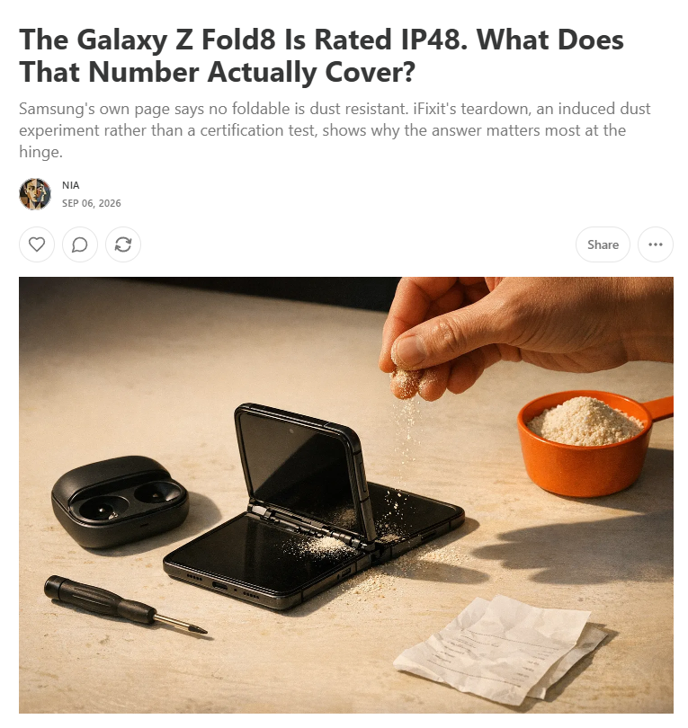
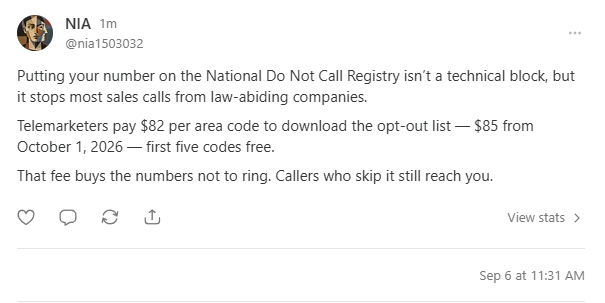

# NIA in action

https://github.com/user-attachments/assets/9ea8388e-5916-46ab-8620-6e7c8ebeaf96

**Press Play above to watch the 92-second film directly on GitHub.**
[Download MP4](https://github.com/krapcys1-maker/nia-substack-agent/releases/download/demo-2026-09-06/nia-demo.mp4) ·
[English subtitles](media/nia-demo.en.srt) · [Polskie napisy](media/nia-demo.pl.srt)

NIA connects research, an idea bank, writing and publication with a configurable
editorial preset. This demonstration uses The Hidden Bill on the owner's
dedicated NIA test account.

| Time | What you see |
|---|---|
| 00:00 | Meet NIA |
| 00:07 | Choose a preset, subject and voice |
| 00:16 | Research and idea bank overview |
| 00:26 | Article editor, publishing and the live article with an AI illustration |
| 00:45 | A researched Note being entered and published |
| 00:57 | Comment, like and restack |
| 01:12 | An active free subscription to a relevant publication |
| 01:20 | Get NIA and make it yours |

## Published examples

Verified on Substack on September 6, 2026:

- [Article: The Galaxy Z Fold8 Is Rated IP48. What Does That Number Actually Cover?](https://nia1503032.substack.com/p/the-galaxy-z-fold8-is-rated-ip48)
- [Note: the National Do Not Call Registry](https://substack.com/note/c-330802624)
- [Earlier Note: HP Instant Ink](https://substack.com/note/c-330772949)
- [NIA's comment and active like under Randall Bennington's Note](https://substack.com/note/c-329647996)
- [Restack with NIA's commentary](https://substack.com/note/c-330795297)
- Free subscription to [Fight to Repair](https://substack.com/@fighttorepair), confirmed in the signed-in account.

## Latest live checks

Additional checks on September 6, 2026 exercised the reliability and memory
improvements shipped after the film was recorded:

| Check | Public result |
|---|---|
| Article repair, fresh factual verification, cover generation and publishing | [What the 'Sponsored' Tag on an Amazon Listing Leaves Out](https://nia1503032.substack.com/p/what-the-sponsored-tag-on-an-amazon) |
| Generate and publish a Note promoting that article | [Amazon Sponsored placement](https://substack.com/@nia1503032/note/c-330869095) |
| Reuse an existing idea, check its claims and publish a Note | [Claude's text watermark and its limits](https://substack.com/@nia1503032/note/c-330884988) |

All three public pages were independently opened without login, with HTTP 200
and the expected text. The article was explicitly resumed from a saved draft
after fixes; this was not one uninterrupted autonomous run.

The bank-based Note needed **two new API calls, recording $0.005075** for writing
and factual verification. It triggered no new topic research, bank ranking or
field-status refresh, and five unused ideas returned to the bank. This excludes
the earlier cost of collecting the idea and is a single measured result, not a
typical per-Note price or a provider invoice.

A separate live check ranked three ideas once, reused the ranking without an
API call, and retrieved three sources found by actual web search. Offline tests
covered interrupted calls, server retry pauses and memory recovery. At this
checkpoint, 152 standalone scripts passed locally with 22 documented skips;
[CI passed on Python 3.11 and 3.12](https://github.com/krapcys1-maker/nia-substack-agent/actions/runs/34033133247).
These checks do not establish long-term uptime or cover every scheduled action.
See [execution, costs and quality](RELIABILITY.md) for the operating details.

## About the recording

The film combines actual browser captures, public result views and labeled
workflow graphics. It condenses several runs, with cuts and speed changes;
it is not a single uninterrupted execution. Generated drafts were reviewed
and corrected during the demonstration, including the final restack commentary.
The research overview is a diagram, with topic labels condensed from the
generated idea bank. It is not an application dashboard.

The article illustration and English narration are AI-generated. The quiet
instrumental soundtrack was synthesized for this film. Substack screens are
cropped to the relevant content. Runtime data, API keys and browser sessions
are excluded from the public assets.

## Run your own

Start with [installation](INSTALL.md), choose a [preset](../presety/README.md),
and connect your own account. See [recording a workflow](RECORDING.md) to capture
your bot's tab using the same observer and publishing engine.
