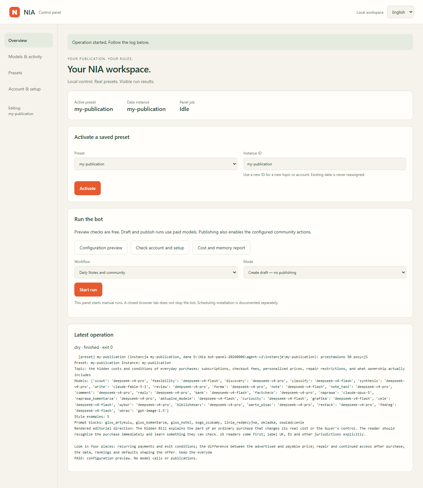
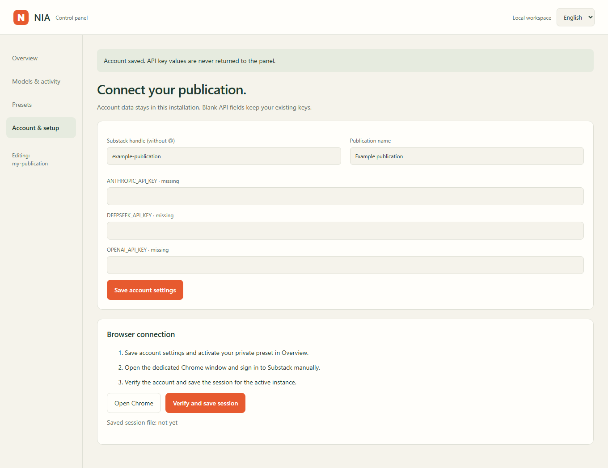
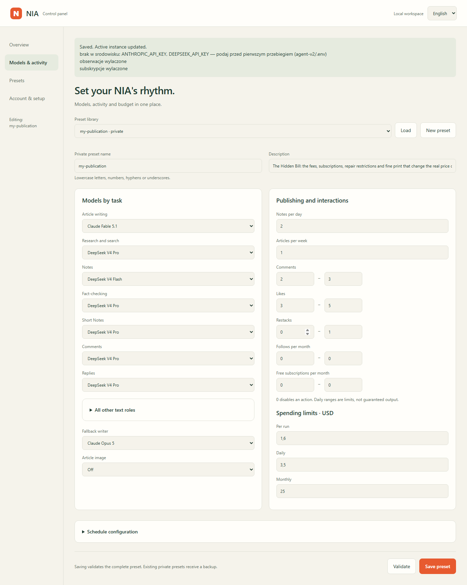
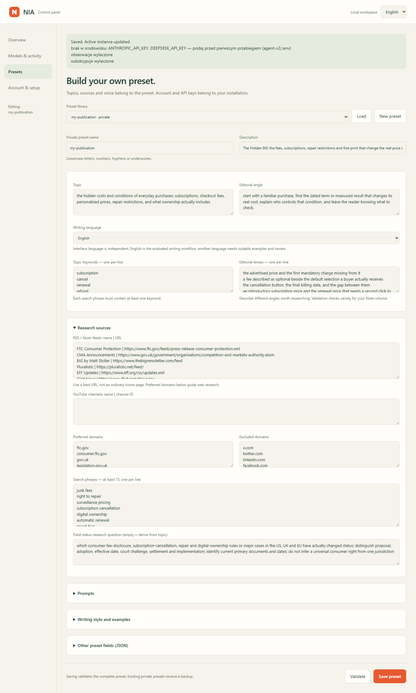

# NIA control panel

[Polska instrukcja](PANEL_PL.md) · [Command-line installation](INSTALL.md)

The local panel edits real presets and starts the NIA engine. It opens in your
browser, with English as the default and a **Polski** switch in the top right.
Python runs locally; model requests go to your configured providers.



Screenshots show the working application with an **example account**, empty API
key fields and a free configuration preview. They are not a connected example
Substack account. Your own account, keys and session remain local.

## 1. Install and open

You need **Python 3.11+** (3.12 recommended), Google Chrome, internet access,
your Substack account/publication and API access for the models you select.
Both bundled presets use Anthropic and DeepSeek. Article images optionally use
OpenAI. Selecting a model does not confirm access on your provider account.

### Windows: first installation

1. Install Python from [python.org](https://www.python.org/downloads/) and enable
   **Add Python to PATH** in its installer. Install Google Chrome separately.
2. [Download NIA](https://github.com/krapcys1-maker/nia-substack-agent/archive/refs/heads/main.zip)
   and extract the entire ZIP into a folder you want to keep. Alternatively,
   clone the repository with Git.
3. Double-click **`Install-NIA.cmd`** inside that folder. It creates a local
   `.venv`, installs the dependencies and Playwright Chromium, then opens NIA.
   The first installation needs a network connection and can take several minutes.
4. Leave the launcher window open. The panel opens at
   **http://127.0.0.1:8765**. This address works on your own computer.

This is a Python application with a browser interface. Python and Chrome are
prerequisites; the launcher does not install them or request your Substack password.
On later runs, double-click **`Start-NIA.cmd`**. Account files are preserved.

### Existing installation, Linux or macOS

Use the Python environment where NIA's dependencies are installed:

```bash
python narzedzia/panel.py
```

From Windows PowerShell, without activating the virtual environment:

```powershell
.\.venv\Scripts\python.exe narzedzia\panel.py
```

If dependencies are not installed, follow [installation steps 1–2](INSTALL.md#1-requirements).
Use `--no-open` to print the address without opening a browser, or `--port 8766`
if the default port is occupied. Keep the server bound to loopback. This guide
covers local use; server browser setup and scheduling are separate work.

## 2. Add your account and API keys

Open **Account & setup**:

1. Enter your **profile handle without `@`**, for example `your-profile-name`.
   A publication URL is not the profile handle.
2. Enter your publication name and API keys for your selected models.
3. Click **Save account settings**.



Keys are saved in `agent-v2/.env`. The UI shows whether each key is configured;
it does not return its value. Leaving a key field blank keeps the existing key.
An active instance belongs to its original account. Use a separate installation
for a different account. Existing environment variables take precedence over files.

## 3. Choose a preset and set models

Open **Models & activity** or **Presets**. Choose **AI** or **Hidden Bill** in
**Preset library** and click **Load**. Loading only opens the editor.

Give your private copy a name such as `my-publication`. Bundled presets are
read-only. You can then change:

- Models for article writing, research, Notes, short Notes, fact-checking,
  comments, replies and the other text roles in the expanded section.
- A fallback writer and optional article image generation.
- Notes per day, articles per week, and interaction ranges. Set both ends of
  an interaction range to `0` to disable it.
- Per-run, daily and monthly budget thresholds in USD.

**DeepSeek V4 Flash** is available in every text-role selector; **Claude Opus 5**
is available for Notes as well. Images have a separate selector. Existing model
IDs come from the engine configuration; availability and billing depend on the provider.



Click **Validate**, then **Save preset**. Validation checks the complete preset
without a paid API request. Warnings about missing keys are not a provider access
test. A successful save writes the files into `presety/<your-name>/`.

## 4. Customize the topic, sources and style

In **Presets**, edit the loaded copy or click **New preset** for a blank editorial
direction. A new preset does not inherit the previous subject's sources or prompts.



Fill in the topic, editorial angle, writing language, niche keywords and editorial
lenses. Add at least **15 search phrases**, each containing a niche keyword.
The validator also checks the number of editorial lenses against the Note volume.

For RSS/Atom, enter one `name | feed URL` per line. For YouTube use
`name | channel ID`. Preferred and excluded domains use one host per line.
Use **Prompts** to edit editorial direction, article/Note/comment voice, audience,
cover style and authorship disclosure.

**Writing style and examples** contains positive and negative style profiles
and an optional example corpus. Separate example paragraphs with blank lines.
When using a corpus, assign one paragraph index, starting at **0**, to each of
the five style roles. Selected paragraphs must each contain **150–900 characters**.
The panel updates the corpus fingerprints and validates those assignments.
Leave the corpus empty to use style profiles alone.

The advanced JSON section exposes the remaining preset fields. Click **Apply
fields** before using the other controls. Always validate and save afterward.
Changing the interface language does not change your writing language.
English is the evaluated writing workflow; Polish output needs Polish style
examples and editorial review.

## 5. Activate and connect the browser

1. In **Overview**, choose your saved preset under **Activate a saved preset**.
2. Enter an instance ID, such as `my-publication`, and click **Activate**.
   Use a new instance for another preset/topic; ownership checks protect existing
   memory. Saving a new copy does not activate it automatically.
3. In **Account & setup**, click **Open Chrome**. Sign in to Substack manually
   in the dedicated Chrome window. Complete any verification shown by Substack.
4. Click **Verify and save session**. Check **Latest operation** for `exit 0` and
   the message confirming the authenticated account matches the configured one.
5. Run **Configuration preview**, then **Check account and setup** in Overview.

The session belongs to `agent-v2/instancje/<instance>/storage-state.json`.
A file marked “saved” can expire; the live verification checks the actual account.
Chrome's debugging port is currently shared within one machine, so do not run
different accounts simultaneously without isolating their browser setup.

## 6. Start the bot and inspect the result

In **Overview**, confirm the **active preset and data instance** at the top.
The run uses that active preset, not an unsaved preset open in the editor.

| Control | What happens |
|---|---|
| **Configuration preview** | Loads real configuration, prompts and style. No model calls or publications. |
| **Check account and setup** | Validates the preset and checks the logged-in account on Substack. No paid model calls. |
| **Cost and memory report** | Reads the active instance's API ledger and memory. No paid calls. A fresh instance has no report yet. |
| **Daily Notes and community** | Runs the daily workflow using configured limits, existing memory and the day's remaining slots. |
| **Article from the idea bank** | Starts the existing article workflow from bank material; an empty bank may yield no article. |

Start with **Create draft — no publishing**. This uses **paid models**, saves
workflow artifacts locally and displays the result in **Latest operation**.
After checking your configuration and output, choose **Generate and publish**
to enable real posts and configured community actions on the active account.
That mode starts a new workflow; it is not an approval button for a previously
generated draft.

`exit 0` means the engine process finished successfully. It does **not** guarantee
a post: daily limits, lack of suitable material, budget limits or editorial checks
can leave slots unused. Read the log for generated/published results. Drafts and
the database remain under `agent-v2/instancje/<instance>/`.

The latest job log and completion status survive restarting the panel. Closing
the browser tab does not stop a job. Let the current job finish before closing
the launcher or changing presets. The panel refuses edits while it or the
instance lock indicates a running operation. The raw engine log and some
validation messages currently remain in Polish in both interface languages.

## 7. Later changes and recovery

Load your **private** preset, change its settings and save it. Editing the active
private preset validates and reactivates it for the same instance, preserving
its memory. Previous versions go to `agent-v2/data/panel/backups/`. An interrupted
preset directory swap rolls back when the panel next opens.

**Schedule configuration** edits the preset's UTC times. The panel currently
starts workflows **manually**; it does not install Windows tasks or Linux timers.
After changing a schedule already installed in the operating system, regenerate
or update those tasks separately. See [scheduling](INSTALL.md#7-schedule-on-your-computer).

If a port is occupied, close the previous panel or use another port. If Chrome
cannot open, confirm Google Chrome is installed and follow the
[browser setup guide](INSTALL.md#5-browser-session).
If validation fails, correct the named field and validate again. Do not repeatedly
restart a paid workflow to test a missing API key; inspect the error first.

The local panel and CLI share the same files and instance protections. Your
private presets, account files, sessions, backups and runtime logs are ignored
by Git. Do not expose this local administrative panel to the public internet.
