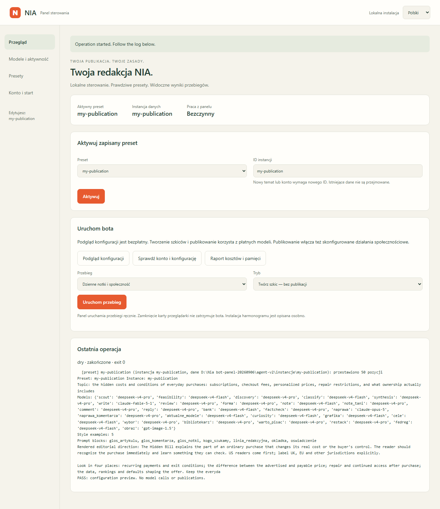

# Panel sterowania NIA

[English guide](PANEL.md) · [Instalacja z terminala](INSTALL.md)

To działający panel lokalny: zapisuje prawdziwe presety i uruchamia silnik NIA.
Otwiera się w przeglądarce. Domyślnie jest po angielsku; w prawym górnym rogu
możesz wybrać **Polski**. Python działa na Twoim komputerze, a zapytania do modeli
trafiają do wybranych dostawców.



Zrzuty pokazują działającą aplikację z **przykładowym kontem**, pustymi polami
kluczy i bezpłatnym podglądem konfiguracji. Przykładowe konto nie jest połączone
z Substackiem. Twoje ustawienia konta, klucze i sesja zostają lokalnie.

## 1. Pierwsza instalacja na Windows

1. Zainstaluj **Python 3.11+**, najlepiej 3.12, z
   [python.org](https://www.python.org/downloads/). Zaznacz **Add Python to PATH**.
   Zainstaluj też Google Chrome.
2. [Pobierz NIA jako ZIP](https://github.com/krapcys1-maker/nia-substack-agent/archive/refs/heads/main.zip)
   i wypakuj cały plik do docelowego folderu. Możesz również pobrać repozytorium Git.
3. Kliknij dwukrotnie **`Install-NIA.cmd`** w wypakowanym folderze. Skrypt tworzy
   środowisko `.venv`, instaluje zależności i Chromium Playwrighta, a potem otwiera
   panel. Pierwsza instalacja wymaga internetu i może potrwać kilka minut.
4. Pozostaw okno uruchamiania otwarte. Panel działa pod adresem
   **http://127.0.0.1:8765** na Twoim komputerze.

Przy kolejnych uruchomieniach klikaj **`Start-NIA.cmd`**. Skrypt zachowuje dane
konta. To aplikacja Python z interfejsem w przeglądarce; Python i Chrome trzeba
zainstalować osobno. NIA nie prosi o hasło do Substacka — logujesz się w Chrome.

Jeżeli masz już środowisko z zależnościami NIA, z katalogu repozytorium uruchom:

```powershell
.\.venv\Scripts\python.exe narzedzia\panel.py
```

W aktywnym środowisku Python, również na Linux/macOS:

```bash
python narzedzia/panel.py
```

Instalacja zależności jest opisana w [instrukcji instalacji](INSTALL.md#1-requirements).
Opcja `--no-open` wypisuje adres bez otwierania przeglądarki. Jeśli port jest
zajęty, użyj `--port 8766`. Ta instrukcja dotyczy komputera lokalnego;
konfiguracja przeglądarki i harmonogramu na serwerze to osobny etap.

## 2. Wpisz konto i klucze API

Otwórz **Konto i start**:

1. Wpisz **uchwyt profilu bez `@`**, a nie adres publikacji.
2. Podaj nazwę publikacji oraz klucze API do wybranych modeli.
3. Kliknij **Zapisz ustawienia konta**.


Gotowe presety używają Anthropic i DeepSeek. Opcjonalne grafiki korzystają
z OpenAI. Klucze zapisują się w `agent-v2/.env`; panel pokazuje tylko, czy klucz
jest skonfigurowany. Puste pole zachowuje dotychczasowy klucz. Wybór modelu na
liście nie potwierdza dostępu do niego u dostawcy.

Aktywna instancja należy do swojego konta. Inne konto uruchamiaj w osobnej
instalacji. Zmienne wyeksportowane w systemie mają pierwszeństwo przed plikami.

## 3. Wczytaj preset i ustaw modele

Wejdź w **Modele i aktywność** lub **Presety**. W **Bibliotece presetów** wybierz
AI albo Hidden Bill i kliknij **Wczytaj**. To otwiera edytor; nie uruchamia bota.
Nadaj prywatnej kopii nazwę, np. `moja-publikacja`. Publiczne wzorce są chronione
przed nadpisaniem.


Możesz zmieniać modele pisania artykułów, researchu, notek, krótkich notek,
sprawdzania faktów, komentarzy i odpowiedzi. Dalsze role są w rozwijanej sekcji.
**DeepSeek V4 Flash** jest dostępny w każdej roli tekstowej, a **Claude Opus 5**
również przy notkach. Grafiki mają osobne ustawienie i można je wyłączyć.

Ustaw liczbę notek dziennie, artykułów tygodniowo, zakresy komentarzy, polubień
i restacków oraz miesięczne obserwacje i bezpłatne subskrypcje. Zakres `0–0`
wyłącza daną interakcję. Limity nie gwarantują takiej liczby wykonanych działań.
Budżety są podawane w dolarach: na przebieg, dzień i miesiąc.

Kliknij **Sprawdź**, a następnie **Zapisz preset**. Walidacja nie wysyła płatnych
zapytań. Zapis tworzy pliki w `presety/<twoja-nazwa>/`.

## 4. Własny temat, źródła, prompty i styl

W zakładce **Presety** możesz edytować kopię lub wybrać **Nowy preset**.
Nowy preset zaczyna z pustym tematem, bez źródeł i promptów poprzedniej publikacji.


Wpisz temat, kąt redakcyjny, język publikacji, słowa kluczowe i obszary tematu.
Dodaj minimum **15 fraz wyszukiwania** — każda musi zawierać słowo kluczowe niszy.
Walidator sprawdza też różnorodność obszarów względem liczby notek.

Kanały RSS/Atom wpisuj jako `nazwa | adres kanału`, po jednym w wierszu.
Dla YouTube podawaj `nazwa | ID kanału`. Domeny preferowane i wykluczone wpisuj
po jednej w wierszu. W **Promptach** ustawisz linię redakcyjną, głos artykułów,
notek i komentarzy, odbiorców, styl okładek oraz informację o autorstwie.

W sekcji **Styl i przykłady pisania** określ dobry styl i rzeczy do unikania.
Korpus przykładów jest opcjonalny. Oddzielaj akapity pustymi liniami, a dla każdej
z pięciu funkcji stylu wybierz numer akapitu liczony od **0**. Wybrane akapity
muszą mieć **150–900 znaków**. Panel przelicza ich odciski i sprawdza przypięcia.
Pusty korpus oznacza korzystanie z samych profili stylu.

Zaawansowane pola są dostępne jako JSON. Po ich zmianie kliknij **Zastosuj pola**,
a potem sprawdź i zapisz preset. Przełączenie języka panelu zachowuje ustawienia
i nie zmienia języka tekstów. Sprawdzany dotąd przebieg pisania jest angielski;
polskie publikacje wymagają polskich przykładów stylu i oceny jakości.

## 5. Aktywuj preset i zaloguj Chrome

1. W **Przeglądzie** wybierz zapisany preset, wpisz ID instancji, np.
   `moja-publikacja`, i kliknij **Aktywuj**. Nowy preset lub temat powinien dostać
   nową instancję; istniejący bank pamięci jest chroniony przed przejęciem.
   Sam zapis nowej kopii nie aktywuje jej automatycznie.
2. W **Konto i start** kliknij **Otwórz Chrome**. Zaloguj się ręcznie do Substacka
   w otwartym oknie. Wykonaj weryfikację, jeśli zażąda jej Substack.
3. Kliknij **Sprawdź i zapisz sesję**. W **Ostatniej operacji** sprawdź `exit 0`
   i komunikat, że rzeczywiście zalogowane konto pasuje do konfiguracji.
4. Uruchom **Podgląd konfiguracji**, a potem **Sprawdź konto i konfigurację**.

Sesja trafia do `agent-v2/instancje/<instancja>/storage-state.json`. Zapisany plik
może wygasnąć; bieżąca weryfikacja sprawdza konto na żywo. Port debugowania Chrome
jest obecnie wspólny na jednym komputerze — różne konta wymagają osobnej
konfiguracji przeglądarek, jeśli mają działać równocześnie.

## 6. Uruchom przebieg

Najpierw sprawdź **aktywny preset i instancję** u góry Przeglądu. Przebieg używa
tej konfiguracji. Niezapisane zmiany w edytorze nie są uruchamiane.

| Przycisk lub wybór | Co robi |
|---|---|
| **Podgląd konfiguracji** | Wczytuje prawdziwy preset, prompty i styl. Bez modeli i publikowania. |
| **Sprawdź konto i konfigurację** | Sprawdza preset oraz konto zalogowane na Substacku. Bez płatnych wywołań modeli. |
| **Raport kosztów i pamięci** | Odczytuje księgę API i pamięć instancji. Nowa instancja może jeszcze nie mieć danych. |
| **Dzienne notki i społeczność** | Uruchamia dzienny przebieg z limitami, pamięcią i pozostałym przydziałem dnia. |
| **Artykuł z banku pomysłów** | Uruchamia przygotowanie artykułu z banku; pusty bank może nie dać artykułu. |

Na początek wybierz **Twórz szkic — bez publikacji**. Ten tryb korzysta
z **płatnych modeli**, zapisuje wyniki lokalnie i pokazuje log.
Po sprawdzeniu ustawień i wyników możesz wybrać **Generuj i publikuj**.
Wtedy bot może rzeczywiście publikować i wykonywać skonfigurowane działania
społecznościowe. To nowy przebieg, a nie zatwierdzenie wcześniejszego szkicu.

`exit 0` oznacza poprawne zakończenie procesu, ale nie gwarantuje publikacji.
Limit dzienny, brak odpowiednich materiałów, budżet lub kontrola jakości mogą
zostawić niewykorzystane miejsca. Wynik przeczytasz w logu. Szkice i baza znajdują
się w `agent-v2/instancje/<instancja>/`.

Log i wynik ostatniego zadania pozostają po ponownym otwarciu panelu. Zamknięcie
karty przeglądarki nie zatrzymuje bota. Poczekaj na zakończenie pracy przed
zamknięciem okna uruchamiania. Panel blokuje zmianę konfiguracji podczas pracy.
Surowy log silnika i część komunikatów walidatora są obecnie po polsku również
w angielskiej wersji interfejsu.

## 7. Zmiany później i harmonogram

Wczytaj swój prywatny preset, zmień ustawienia i zapisz. Aktywny preset zostanie
sprawdzony i ponownie aktywowany w tej samej instancji, bez kasowania pamięci.
Kopie poprzednich wersji są w `agent-v2/data/panel/backups/`. Przerwany zapis
presetu jest wycofywany przy kolejnym otwarciu panelu.

**Konfiguracja harmonogramu** zapisuje godziny UTC w presecie. Ta wersja panelu
uruchamia przebiegi **ręcznie** i nie instaluje zadań Windows ani timerów Linux.
Po zmianie godzin już istniejące zadania systemowe trzeba zaktualizować osobno.
Zobacz [harmonogram](INSTALL.md#7-schedule-on-your-computer).

Jeżeli panel nie startuje, sprawdź komunikat w oknie uruchamiania. Zajęty port
rozwiąż przez zamknięcie poprzedniego panelu lub zmianę portu. Jeśli Chrome się
nie otwiera, sprawdź jego instalację i [konfigurację przeglądarki](INSTALL.md#5-browser-session).
Przy błędzie API przeczytaj log przed ponownym płatnym uruchomieniem.

Prywatne presety, klucze, sesje, kopie zapasowe i logi są ignorowane przez Git.
Panel służy do lokalnego zarządzania — nie wystawiaj go publicznie do internetu.
